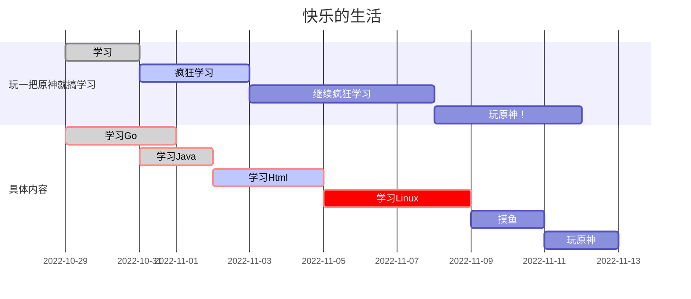

# 蓝山工作室技术部门通识课

## 编程软件

工欲善其事，必先利其器。想要优雅且高效的编写代码，就必须要掌握一款开发工具


年轻人，你渴望力量吗？

装完这些你就变成大佬了（确信）

### VSCode


#### 介绍

Visual Studio Code 以其轻量且强大的代码编辑功能和丰富的插件生态系统，独受前端工程师的青睐。

Visual Studio Code 默认支持非常多的编程语言，包括HTML 和 CSS， JavaScript、TypeScript；也可以通过下载扩展支持 Python、C/C++、Java 和 Go 在内的其他语言。支持功能包括语法高亮、括号补全、代码折叠和代码片段；对于部分语言，可以使用 IntelliSense。

#### 安装

进入[vscode官网](https://code.visualstudio.com/)下载或者[点击这里](https://pan.stellaris.wang/d/aliyun/software/pc/%E7%BC%96%E7%A8%8B%E8%BD%AF%E4%BB%B6/VSCodeUserSetup-x64-1.72.2.exe)下载

#### 插件

| 插件                      | 作用         |
| ------------------------- | ------------ |
| Prettier - Code formatter | 代码格式化   |
| Path Intellisense         | 路径自动提示 |
| TODO Highlight            | TODO 高亮    |
| Auto Rename Tag           | 标签命名     |
| GitLens                   | 显示git记录  |
| Bracket Pair Colorizer    | 括号颜色     |
| Code Runner               | 运行文件     |

#### 快速添加标签

### JetBrains


#### 介绍

[IDEA官网](https://www.jetbrains.com/zh-cn/idea/)

#### 安装

[开发环境准备](https://blog.stellaris.wang/p/go/go-perpare/)

## Git


Git 和 GitHub 是各个领域的开发者都应该学习的两项技术。

### GitHub是什么？

GitHub 是目前世界上最大的代码托管平台

### Git是什么？

Git 是目前世界上最先进的分布式版本控制系统

#### 什么是版本控制系统？

比如说你将来给甲方做🐂🐎了，你要给甲方写一个项目文档...


你学聪明了，之后你给每个版本的文档建立了一个独立文件...


于是你想，如果有一个软件，不但能自动帮我记录每次文件的改动，这样就不用自己管理一堆类似的文件了，也不需要把文件传来传去。如果想查看某次改动，只需要在软件里瞄一眼就可以，岂不是很方便？

这个软件应该是这样的：

| 版本号 | 文件名        | 用户   | 说明         | 日期                |
| ------ | ------------- | ------ | ------------ | ------------------- |
| 1      | 项目文档.docx | 王鑫   | 初版         | 2022-10-29 12:55:22 |
| 2      | 项目文档.docx | 袁神   | 增加项目说明 | 2022-10-29 15:23:34 |
| 3      | 项目文档.docx | 灿灿   | 添加项目细节 | 2022-10-29 16:22:03 |
| 4      | 项目文档.docx | 荟荟子 | 修改拼写错误 | 2022-10-29 18:43:49 |


#### 什么是分布式？


集中式版本控制系统，版本库是集中放在中央服务器的，而干活的时候，用的都是自己的电脑，所以首先要从中央服务器哪里得到最新的版本，然后干活，干完后，需要把自己做完的活推送到中央服务器。集中式版本控制系统是必须联网才能工作，如果在局域网还可以，带宽够大，速度够快，如果在互联网下，如果网速慢的话，就纳闷了。

分布式版本控制系统，那么它就没有中央服务器的，每个人的电脑就是一个完整的版本库，这样，工作的时候就不需要联网了，因为版本都是在自己的电脑上。既然每个人的电脑都有一个完整的版本库，那多个人如何协作呢？比如说自己在电脑上改了文件A，其他人也在电脑上改了文件A，这时，你们两之间只需把各自的修改推送给对方，就可以互相看到对方的修改了。

### 使用


[Git从入门到入狱](https://blog.stellaris.wang/p/experience/git/)

#### 基本配置

```
$ git config --global user.name "Your Name"
$ git config --global user.email "email@example.com"
```

#### 基本操作

**创建版本库（init）**

**将文件添加到暂存区（add）**

**将暂存区里面的文件添加到版本库（commit）**

**查看仓库状态（status）**

**查看仓库中的具体修改（diff）**

**查看提交历史记录（log）**

**查看命令历史（reflog）**

**版本回退（reset --hard）**

**撤销修改（checkout）**

**删除文件（rm）**

#### 分支管理

**查看分支（branch -v）**

**创建分支（branch branchname）**

**切换分支（branch branchname）**

**合并分支（merge）**

**删除分支（branch -d）**

#### 远程仓库

**添加远程仓库（remote add）**

**推送本地内容到远程仓库（push）**

**从远程克隆仓库到本地（clone）**

**修改本地指向远程仓库地址（remote set-url）**

**获取远程数据的变更（fetch/pull）**

#### 标签管理

**创建标签**

**查看标签**

**删除标签**

## Typora

### 什么是markdown？


首先，Markdown是一门标记语言。假如你们知道HTML的话，Markdown和HTML可以认为是同类事物。简而言之，就是用纯文本的代码描述带格式文本的一种方法。

那么有了HTML，要Markdown有何用？最简单的答案是：HTML太难写了！


这样对于关注内容的作者而言友好了很多，而且即使是Markdown代码也有相当强的可读性。

于是写好Markdown后，如何将其显示成我们想要的格式呢？通常的做法是将Markdown编译为HTML。其实一些网站已经自带了这样的编译器，输入Markdown代码后直接将其转化为HTML，就可以交给浏览器渲染了。GitHub上的README以及各种.md格式文件的预览功能就是最典型的例子。

Markdown 编写的文档后缀为 `.md`, `.markdown`

### 什么地方会用到markdown？

Markdown可以广泛用于文档、博客、论坛等带格式文本内容的创作，习惯后使用起来会比所见即所得的HTML编辑器更加方便快捷，较Word等格式又有纯文本这一优势。

### 什么是Typora？


Typora 是一款**支持实时预览的 Markdown 文本编辑器**。

有一种爱情是一触即发。看到Typora的第一眼，我就爱上了它。它没有专业软件那么复杂而难以上手的功能，却也没有为了简洁而妥协到难以使用，它的每一寸肌肤都恰到好处，与它相处的每一刻都十分愉悦。

Typora 一直是我认为桌面端笔记应用应有的终极形态。用一句话来概括就是它的**功能之强大、设计之冷静、体验之美妙、理念之先进**。

### 功能

#### 实时预览

我想很果断地下这个结论：到现在还不支持编辑界面实时预览的 Markdown 编辑器基本可以退出市场了。Typora 在这一方面显然已经领先了一大步——他们连 Markdown 语法的标记都在实时预览中消去了。当你离开正在编辑的有格式的文本段后，Typora 会自动隐藏 Markdown 标记，只留下**「所见即所得」**的美妙。*他们把这称为 Hybrid View。*

#### 数学公式支持

Typora对于 LATEX 语法支持的非常完善，内置的渲染引擎堪称完美，同类App我没见过比它更好的。
$$
\int^b_af(x){\rm d}x=F(x)\mid^b_a=F(b)-F(a)
$$

#### 代码高亮

```go
package main

import "fmt"

func main(){
    fmt.Println("Hello world")
}
```

#### 表格

在 Markdown 中插入表格一直是一件比较头疼的事情。在一般的 Markdown 编辑器中，你可以通过以下的格式插入表格：

```
| 左对齐 | 右对齐 | 居中对齐 |
| :-----| ----: | :----: |
| 单元格 | 单元格 | 单元格 |
| 单元格 | 单元格 | 单元格 |
```

乍一看还挺直观好用的是吧？但想想，一旦表格内容层次不齐，又或是表格长得难以下手，直接用键盘输入表格就显得十分麻烦和痛苦了。

好在 Typora 为我们提供了图形界面的插入表格的功能

| THead1 | THead2 | THead3 |
| ------ | ------ | ------ |
| 11     | 12     | 13     |
| 21     | 22     | 23     |
| 31     | 32     | 33     |

#### 文件系统

- **快速打开：**你可以通过 `文件 - 快速打开...` 或 `Ctrl + P` 快捷键快速打开最近的文档。
- **保存：**Typora 支持自动保存，一般很少有写好的文档丢失的情况。同时它也提供了诸如「保存」、「另存为」、「保存全部打开的文件...」之类的功能。
- **导入：**Typora 支持非常多的文件格式：.docx, .latex, .tex, .ltx, .rst, .rest, .org, .wiki, .dokuwiki, .textile, .opml, .epub。
- **导出：**Typora 原生支持导出 PDF，HTML等格式。你可以根据软件内提示安装 **Pandoc 插件**来导出更多例如 docx，LaTeX 等格式。 

#### 支持HTML标签

Typora 支持许多常用的 HTML 标签，如果你了解 HTML 语法的话，你可以写出十分美观丰富的文档页面。


有了这一功能，我们就可以在 Typora 中创造出远超普通 Markdown 文档的页面效果。

#### 流程图

Typora可以直接在markdown中画流程图，而且语法简洁易懂，这是个让我异常惊喜的功能。

Typora支持三类流程图：

- sequence
- flowchart
- gantt

我们依次介绍。首先，只需要敲入以下代码，然后选择语言为`sequence`即可生成下面的图

```text
袁神 -> 杰杰子: 你今天玩原神了吗？
Note right of 杰杰子: 杰杰子心想
杰杰子 --> 袁神: 我玩了，你呢？
```

```sequence
袁神 -> 杰杰子: 你今天玩原神了吗？
Note right of 杰杰子: 杰杰子心想
杰杰子 --> 袁神: 我玩了，你呢？
```


对于Flowchart，可以使用下面的code，然后语法选择flow

```text
st=>start: 闹钟响起
op=>operation: 与床板分离
cond=>condition: 分离成功?
e=>end: 快乐的一天

st->op->cond
cond(yes)->e
cond(no)->op
```

```flow
st=>start: 闹钟响起
op=>operation: 与床板分离
cond=>condition: 分离成功?
e=>end: 快乐的一天

st->op->cond
cond(yes)->e
cond(no)->op
```

Mermaid是另一个流程图生成的引擎，在官网中它是这么介绍自己的

> Generation of diagrams and flowcharts from text in a similar manner as markdown.

除了Sequence和Flowchart两类图之外，Mermaid还提供一种叫做gantt的图。插入下面的代码，然后语法选`mermaid`就会自动渲染成gantt图了。

```test
gantt
        dateFormat  YYYY-MM-DD
        title 快乐的生活
        section 玩一把原神就搞学习
        学习            :done,    des1, 2022-10-29,2022-10-31
        疯狂学习               :active,  des2, 2022-10-31, 3d
        继续疯狂学习               :         des3, after des2, 5d
        玩原神！               :         des4, after des3, 4d
        section 具体内容
        学习Go :crit, done, 2022-10-29,72h
        学习Java          :crit, done, after des1, 2d
        学习Html             :crit, active, 3d
        学习Linux        :crit, 4d
        摸鱼           :2d
        玩原神                      :2d
```



#### 大纲视图

Typora会自动将Heading统计作为文章的大纲，而且根据标题的级别自动进行树状归纳。这个功能真的很贴心，尤其是文章长了的时候，只需要点击大纲中的标题就能很方便地跳转。

## 提问的智慧（重点！！！）

[GitHub](https://github.com/ryanhanwu/How-To-Ask-Questions-The-Smart-Way/blob/main/README-zh_CN.md)

你们或许在提问题的时候觉得我们很傲慢？

### 🐂🐎问题

- 手机拍代码
- 只说一个笼统的问题，不说细节
- 夺命连环问


### 例子

**你以为的傲慢**：

- 学弟：学长我vscode装不上了怎么办？
- 学长：你到官网下载安装包下载完双击它，一直点下一步就安装好了
- 学弟：官网是什么
- 学长：https://code.visualstudio.com/
- 学弟：下载按钮在哪？
- 学长：（截图）
- 学弟：好了，下载到了，然后呢？
- 学长：这个都不会还是别学了
- 学弟：（感觉学长很傲慢）...

**实际上的傲慢：**

- 学弟：学长我的电脑是64位的windows 10，我在vscode官网下载 了对应版本，在我安装过程中出现了这个问题，使用百度搜索后还是没有办法解决，你能帮我看看吗？谢谢。（同时
- 贴上安装失败的图片）

- 学长：这个都不会还是别学了


### 我们为什么对你们提的问题感到厌烦？

- 提的问题“过于简单“

- 提问题的方式不对

- 遇到问题就提问

### 问问题要讲究策略

你可以根据以下顺序尝试解决你的问题：

1. 百度/Google
2. 项目使用文档、API使用说明
3. CSDN/Stack Overflow
4. 尝试分析源码

### 怎么问问题？

- 精确地描述问题并言之有物

    - 仔细、清楚地描述你的问题或者Bug的症状
    - 描述问题发生的环境
    - 描述在提问前你是怎样去研究和解决这个问题的
    - 描述在提问前你为了确定问题而采取的诊断步骤
    - 尽可能地提供一个可以`重现这个问题的可控环境`的方法

- 话不在多，在于精

    你需要提供精确有内容的信息

    这并不是要求你简单的就把成堆的错误代码或者资料完全放在你的提问中，如果你的问题是一个很大的是程序挂掉的这样一个代码运行环境，尽量把它剪裁得越小越好。

    这样做的好处至少有三点：

    - 第一，表现你为简化问题付出了努力，这可以使你得到回答问题的概率增加
    - 第二，简化问题使你更有可能得到有用的答案
    - 第三，在精炼你的 bug 报告的过程中，你很可能就自己找到了解决方法或者权宜之计

- 清楚明确地表达你的需求

    漫无边际的提问是近乎无休无止的时间黑洞。

    最有可能最有能力给你有用答案的人通常也是最忙的人（他们忙是因为要亲自完成大部分工作）。所以我们对这样无休止无节制的时间黑洞是相当厌恶的。

    所以，请界定一下你的问题，使我们花在辨识你的问题和回答所需要付出的时间减到最少。

- 询问有关代码的问题时

    千万不要动辄就要求别人帮你去调试有问题的代码，而且也不提示一下应该从何入手。

    张贴几百行的代码，然后说一声：`这段代码有问题`，我们可能完全会忽略这样的问题，而且回都不想回

    相比于这个，只贴几十行的代码，然后说一句：`在第七行代码之后，我觉得程序会输出xxx，但实际出现的xxx`更有可能让你得到回应

    最有效描述程序代码问题的方法就是提供一段最精简的 Bug 展示的测试用例。

    什么是最精简的测试用例？那是问题的缩影；就是一小个代码片段能够刚好的展示出程序的异常行为，而不包含其他令人分散注意力的代码的内容。

    怎么才能找出最精简的测试用例？如果你知道哪一行或者哪一段代码会造成异常的行为，复制下来并且加入能够重现这个状况的代码（能让这段异常的代码正常运行）。如果你无法将问题缩减到一个特定区块，就复制一份代码并移除不影响产生问题行为的部分。总之，你发出的测试用例（或代码）越少越好。

- 截图的方式

    不要手机拍照！不要手机拍照！不要手机拍照！

- 有礼貌地提问

    多用`请`和`谢谢你的回答`，让回答者知道你对他们能够花费掉自己宝贵地时间来对你提供帮助心存感激。

### 写在最后

我们并不是不愿意帮你解决问题，我们帮不帮你的标准就是，你问的问题，到底是不是真正的问题，是你思考，在自己做出努力前仍无法无法解决的问题，还是你懒得自己动手只是把我们当作机器，当作字典去查询？

我们可以帮助你解决你的难题，而且是非常乐意的，但是我们不想手把手教你写字，这些需要你自己去练习。

我们这不是傲慢，这是珍惜自己的时间。