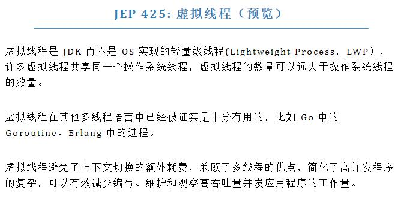

# goroutine，channel，select

# 概念篇

## 术语

> 这里简单的介绍一下接下来内容中出现的一些术语

- 运行时：大多数编程语言都有自己的运行时，所谓运行时就是程序运行的时候，那些为你的代码提供依赖，管理内存等的后台
  - 有些语言的运行时很弱，如 Rust，C，Zig 等，编译出来的可执行文件通常比较轻巧
  - 有些语言的运行时直接做成了操作系统的形状，例如 Java 的 JVM
    - Java 编译出来的 class 虽然挺小的，但不算可执行文件，想想 JRE 都有快100MB了
- UNIX/UNIX-Like：UNIX是最早的一批操作系统，现在很多操作系统和当初的 UNIX 设计很像，如 Linux，FreeBSD 等，统称为 UNIX-Like
- 调度：指多段程式之间的运行状态的切换，排列，组织等
- 并发/并行
  - 并发：类似一个人一段时间内处理多个事情
  - 并行：类似很多人同时处理多个事情
- 上下文切换：调度中的切换
- 系统调用：程序是由普通指令和系统调用指令组成的，当发生系统调用时，操作系统内核态会被激活，这时操作系统掌握进程和线程的生杀大权。普通程序需要和某些计算机硬件通讯、创建或使用操作系统中其他对象一般都需要通过操作系统提供的系统调用才能实现，与此同时，系统调用让计算机从用户态切到内核态再切回来会损失一些时间。
- 时间片：一段时间，通常来说非常短，时间片是由操作系统分配给某个线程执行的时间限制，线程之间需要抢这个时间片才能被执行。

## 协程、线程、进程、轻量级线程

------

> goroutine 不是协程！它属于轻量级线程！（

> 共同点：

- 采用了这些组件的程序都可以称其为并发程序 (进程除外，进程就是程序的具现化)
- 它们每一个都只是一段程式(代码)，这些程式具有一定的独立性，例如某个被封装好的函数里面的代码、某个类、某个程序等。
- 每一个协程/线程/.. 之间彼此独立，没有外加的顺序控制下，它们的执行顺序都是随机的
  - 例如 A, B 两个线程，真正执行每一步时 A，B  都有可能被执行(如果是多核处理器，AB 还可能被同时执行)
  - 从此程序的执行路径从串行的一条线，变成了树形的一棵树(其中每一条路径都有可能发生)
  - 想验证程序的正确性变得十分困难了，需要从树状路径中穷举出每一条路径，证明其正确

### 协程

------

[协程 - 维基百科，自由的百科全书](https://zh.wikipedia.org/wiki/协程)


协程诞生

- 按照高老爷子的说法，协程的诞生比线程还早
  - 1958年那会计算机还在用晶体管，UNIX都还没诞生
- 没有官方的定义
  - Wiki 则是通过总结很多语言的协程的特性而编写的
- 所以协程不是轻量级线程
  - 你听说过爸爸是轻量级儿子的吗？
  - 如果不去关注这些历史，我个人认为协程和轻量级线程依旧不能划等号

协程调度的特性

- 协作式 (区别于线程的抢占式)
  - 任务的类型决定调度，而非操作系统或语言的运行时进行规则化调度

### 线程、进程

------

进程是操作系统诞生时所提出的概念，有**官方的定义**

(我并没有找到 UNIX 对其定义，这里用 AMD64 System V ABI 中进程的初始化文档代替)

https://refspecs.linuxbase.org/elf/x86_64-abi-0.99.pdf

第 3.4 节 **Process Initialization** 介绍了一个进程是如何被创建的，也算是一种定义吧（当然我也看不明白是啥，你们感兴趣可以看一下，是介绍大多数 UNIX-Like 操作系统的设计规范的

线程是伴随着进程而诞生的，它的目的就是细化操作系统对程式的调度，来加快进程的运行速度

- 调度一个进程花费的时间要比调度一个线程要长很多
- 线程是操作系统能感知的最小调度单位
  - 也就是说轻量级线程，协程的调度操作系统都不知道
- 进程需要并行运行
  - 不能多线程并行执行，那玩游戏直接一核有难，八核围观了

线程调度的特性

- 抢占式
  - 由操作系统决定调度(不准确的来讲就是谁抢到了执行的权利就执行谁)

### 轻量级线程

------

> 其实并没有这个概念，这只是网上很多人把 goroutine，erlang 中的进程等 这些和线程类似，但区别于线程的东西起的名字。

> 大多数人都认为协程是一种轻量级线程，这种描述不一定和这里的冲突，他们只是想表达协程和线程之间的微妙关系。而这里突出在最后的”线程”那里，即认为轻量级线程是对线程的推广，它具有线程的大部分特性。

这种轻量级线程有着和线程类似的行为，但它们的调度不需要执行线程调度的系统调用，所以通常来说它们的上下文切换的速度可以非常快，并且它们占用的内存也可以做到比线程更少，启动的速度也可以比线程更快

Java19 有关虚拟线程的预览

- 其实就是想偷 golang 的 goroutine 罢！（暴论
  - Java：窃 Code！ 读书人的事，能算偷么？
- 虽然目前没有相关的性能测试，我本人觉得这个虚拟线程的性能可能会比 goroutine 还强
  - 你听说过 “后来者居下” 么？
  - Java 有即时编译器 (JIT)，这就是在耍流氓了

[JEP 425: Virtual Threads (Preview)](https://openjdk.org/jeps/425)



调度的特性

- 抢占式
  - 由语言的运行时来进行调度(通常来说是抢占式，例如 golang 中的 GPM 调度器)
    - 上下文切换由语言运行时管理，所以才不需要进行系统调用

### 小结

我们可以看出，只有协程的调度特性是”协作式”，这种模式其实非常笼统，什么叫协作式？抢占式算协作吗？很难去定义，包括当初提出协程时，也只是说协程可以随时挂起，恢复什么的

通常来说，协作式到代码层面那块就是让程序员自己调度协程去，例如安卓开发中，将网络请求的程式打包成协程(挂起函数)，丢进 IO 线程里，等结果出来了就拿回来放 UI 线程里刷新页面，这本质上和多线程开发没什么区别，只不过那些语言的一些特性美化了多线程开发时遇到的种种问题(回调地狱，一堆 await，async, Promise)，这种协程还只算一个线程语法糖。

而对于 golang 这种主打简单，高效开发的语言，自然是把调度收纳进运行时里，程序员用的时候 go 一个函数就完事了，这种方式也带来了很多好处，一是再也不用担心程序员会写出窒息的调度方式了，还有大多数情况下可以吊打使用普通线程的并发能力（

不过以上的种种分类，都是建立在协程的 wiki 上的，wiki 也并非官方定义，每个人都可以有不同的看法，你当然可以认为除了进程，线程就是协程，你也可以认为协程是轻量级的线程，只要你以后足够牛逼，你说的话就是有重量的

这里贴出一个大佬对 kotlin 协程的解释，其中介绍了一点  goroutine

这位可是重量级，谷歌 GDE，出版过《深入理解 Kotlin 协程》

（题外话，他在微信群中吹水时透露他本科也是邮专的

https://www.bennyhuo.com/2019/10/19/coroutine-why-so-called-lightweight-thread/

## **Share Memory By Communicating**

------

[Share Memory By Communicating - The Go Programming Language](https://go.dev/blog/codelab-share)

这是一种并发编程的思想

当我们开始写并发程序的时候，我们经常会遇到一个的需求: 在不同的线程中交流数据

两个例子🌰

- 程序中: 有一群不断获取 URL 的线程和一群不断爬取 URL 的线程，我们希望前者把获取的 URL 交给后者，并且希望不会出现并发问题(比如一个 URL 爬取了两次，少交 URL，URL交了一半 之类的)
- 生活中: 工厂里上游的机器生产零部件，下游的工人组装，我们也不希望出现问题(零部件缺少，零部件重复)

观察上面两个例子后，你会发现他们具有很强的联系性，这时候如果让你在程序中设计一个方法解决例子一中的问题，你可能会有如下想法:

在两类线程之间维护一个类似工厂中传送带一样的管道，数据通过这个管道流动到爬取 URL 的线程中，只要保证这个管道流入和流出的顺序不会被打乱就行

**这就是 Share memory by communicating**

当然，现在你可能觉得这应该是一个很常见的做法啊，为什么可以被称作一个新的并发编程的思想？

其实，这种问题在程序中，我们一直以来都是这样处理的:

1. 定义一个全局可以访问的集合
2. 保证集合只能同时被一个线程修改或者读取(加锁)
3. 获取 URL 的线程往后面加，爬取 URL 的线程从前面取
4. 如果集合满了，那获取 URL 的线程需要被挂起，或者集合空了，爬取 URL 的线程需要挂起 (性能优化方面，挂起可以避免线程空转、不停尝试修改集合)

你听完可能觉得: 这不就是刚刚想出来的维护一个管道么？这个集合不就是管道!

确实，所以你最后得到的代码长这样:

```go
// 爬取 URL 的部分

type Resource struct {
    url        string
    polling    bool
    lastPolled int64
}

type Resources struct {
    data []*Resource
    lock *sync.Mutex
}

// 爬取函数，开很多个线程执行这个函数即可爬取
// 获取 URL 的部分只需要更新 res 中 data 即可
func Poller(res *Resources) {
    for {
        // 拿到最早的提交(最新提交的)
        // 把它标记成 正在爬取
        res.lock.Lock()
        var r *Resource
        for _, v := range res.data {
            if v.polling { // 如果已经是正在爬取就不用管
                continue
            }
            if r == nil || v.lastPolled < r.lastPolled {
                r = v
            }
        }
        if r != nil {
            r.polling = true
        }
        res.lock.Unlock()
        if r == nil {
            continue
        }
        // 爬取这个 URL，并且更新最近爬取时间
        res.lock.Lock()
        // 假设这里是你的爬取 URL 的代码
        // ...
        // 爬取结束
        r.polling = false
        r.lastPolled = time.Nanoseconds()
        res.lock.Unlock()
    }
}
```

但这也太长了! 并且整段代码真正重要的逻辑只有几行，而且这还不带挂起，res 中的 data 空了依旧会空转消耗 CPU

但是有了 channel 之后

```go
type Resource string

func Poller(in, out chan *Resource) {
    for r := range in {
        // 假设这个地方爬取 URL
        // ...
        // 爬取结束
        // 把爬取过了的 URL 发送给 out 管道里
        out <- r
    }
}
```

变短了，获取 URL 的那些线程只需要往 in 管道里添加 URL 即可，并且最早添加的最先拿出

而且 in 里面没有数据了，会挂起这个 goroutine，不会让它空转消耗 CPU

### 小结

在之前，我们需要维护序列、维护一把锁、维护除了 URL 这个重要的数据外一堆数据，才能做到使用 channel 中的那个效果。

这时候编写并发程序时，我们的思想发生了微妙的变化，对比两个 Resource 类型，之前的是一个结构体，里面包了很多需要的变量，其中也包括重要的 URL，而使用 channel 后，Resource 类型就是 URL 的字符串类型，Resource 就是 URL。主体变得更加突出了，交流的主体就是数据，Sharing memory 和 communicating 从之前的 `communicate by sharing memory` 到现在的 `share memory by communicating`

## 多路复用

[多路复用 - 维基百科，自由的百科全书](https://zh.wikipedia.org/wiki/多路复用)

这个概念源自于 通信和计算机网络，简单的解释看完下面的图就明白了


多路复用就是将多个信道合为一个信道管理

在通信领域上，这个技术可以将很多低速信道合并到一个高速信道上，这样可以节约铺设线路的成本

在计算机网络领域上，这个技术可以让一个线程同时处理多个连接的数据，节约操作系统的开销

但我们今天的主题是 `select`，先看一段代码

```go
ch1 := make(chan int)
ch2 := make(chan int)

for{
  select {
	case v, ok := <- ch1:
		handleCh1(v)
	case v, ok := <- ch2:
		handleCh2(v)
	}
}
```

聪明的你看完了就知道了什么意思了：这不就是多路复用

一个 select 监听多个 channel(信道)，有数据就会处理，没有数据就会阻塞

不过很遗憾的就是，大多数常用的语言一开始设计时都没有这个功能， golang 做到了一开始就将这个功能提炼出来，作为一个关键字 `select`

- Java 中从 BIO(阻塞 IO)，到 NIO(多路复用IO)，再到 AIO(异步IO)

最后来看一下不使用 select，阻塞式 IO 的写法

```go
ch1 := make(chan int)
ch2 := make(chan int)

go func() {
	for {
		v, ok := <- ch1
		handleCh1(v)
	}
}()

go func() {
	for {
		v, ok := <- ch2
		handleCh2(v)
	}
}()
```

它得开两个 goroutine 才能处理这两个 channel 中的数据，看起来很捞，但是它的性能不一定比使用 select 差，它有两个 goroutine，也就是有两个”信道”，它可以真正做到异步处理 ch1 和 ch2，性能绝对不会比只使用一个”信道”的 select 差，但是我们开发中仍然推荐使用 select

直接使用 goroutine 的缺陷

- channel 数目很多造成开了很多 goroutine，运行时调度起来有压力
  - 其实 channel 数目不会很多（不然 select 写一堆 case 也麻烦
- 很难做到半途终止，只能通过关闭所有的  channel 才能终止
- 既然可以开多个 goroutine 直接处理，那我也可以开多个 goroutine 来 select (类似 Reactor 模型)
- 很多时候 channel 里都没有数据，大部分的时间其实都在阻塞上，开很多 goroutine 的优势就没那么明显了，反而会使用更多的内存
  - 平均一个 goroutine 占 8kb 左右

### 小结

> 没有小结

# 实践篇

> Talk is cheap, show me the code.   ——  Linus Torvalds

> Code is cheap, show me the money

## Goroutine

1. 场景一：复读机

```go
func main() {
	repeater()
}

func repeater() {
	for {
		time.Sleep(time.Second)
		fmt.Println("over.")
	}
}
```

> 我想让更多的 `over.` 打印出来

```go
func main() {
	go repeater()
	go repeater()
	repeater()
}

func repeater() {
	for {
		time.Sleep(time.Second)
		fmt.Println("over.")
	}
}
```

> 现在可以每次多打2个 `over.` 了，好耶

- Goroutine 可以让一个函数独立的运行

- go 关键字后接上一个函数执行的表达式后，会启动一个 goroutine 并立即返回，不会等待这个函数执行完

- 为什么不会打印出 

  ```
  o*over.*ver.
  ```

   ??

  - `ov*over*er*.*.`
  - …

1. 场景二：多开战神

```go
func main() {
	go learnFrontend()
	go learnAndroid()
	go learnMachineLearning()
	learnBackend()
}

func learnBackend() {
	time.Sleep(10 * time.Minute) // 十分钟速通 web 后端（确信
	fmt.Println("会了！")
}

func learnFrontend() {
	time.Sleep(time.Nanosecond)
	fmt.Println("会了！")
}

func learnAndroid() {
	time.Sleep(20 * time.Minute)
	fmt.Println("悔了！")
}

func learnMachineLearning() {
	time.Sleep(114514 * time.Minute)
	fmt.Println("废了！")
}
```

### 注意

相信没有人会执行完场景二的代码，但如果真的去执行的话，会发现 `learnAndroid` 和 `learnMachineLearning` 并没有执行完

- main 函数其实也是一个 goroutine，程序的终止条件是：main goroutine 执行完毕
- 当 main goroutine 执行完了，程序就会终止，其他 goroutine 不论是否执行完毕都会退出

## Channel

1. 场景一：电子厂流水线

```go
type Item struct {
	Name  string
	Count int
}

func main() {
	pipeline := make(chan Item, 10) // 一条可以放 10 个 item 的流水线
	go func() {
		for {
			time.Sleep(1 * time.Second)
			pipeline <- Item{
				Name:  "螺丝",
				Count: 5,
			}
		}
	}()
	go func() {
		for {
			time.Sleep(2 * time.Second)
			pipeline <- Item{
				Name:  "齿轮",
				Count: 3,
			}
		}
	}()
	for {
		item := <-pipeline
		fmt.Printf("%#v\\n", item)
	}
}
```

1. 场景二：杰哥家有好康的

```go
func main() {
	好康的 := 欢迎来我家玩()
	打电动() // 阿伟想在去杰哥家的路上打电动
	fmt.Println(好康的)
}

func 欢迎来我家玩() string {
	// 花费 5s 前往杰哥家
	time.Sleep(5 * time.Second)
	return "登dua郎"
}

func 打电动() {
	fmt.Println("输了啦，都是你害的")
}
```

> 上面的代码其实并不符合要求，阿伟打电动是到了杰哥家🏠才开始的，杰哥早就给阿伟看了登dua郎

> 方式一：

```go
func main() {
	// 方式一：
	go 打电动()
	好康的 := 欢迎来我家玩()
	fmt.Println(好康的)
}

func 欢迎来我家玩() string {
	// 花费 5s 前往杰哥家
	time.Sleep(5 * time.Second)
	return "登dua郎"
}

func 打电动() {
	fmt.Println("输了啦，都是你害的")
}
```

> 在阿伟前往杰哥家之前 go 了一个`打电动()`，这样就可以边打电动边去杰哥家了！

> 方式二： 我们知道 当阿伟到了杰哥家，杰哥就会给阿伟看一个东西 (返回 string 类型)，我们就可以用一个 `承诺(Promise)`，来表示这个未来会出现的东西，并且我们希望可以随时等待到这个”承诺”发生

```go
func main() {
	// 方式三：
	var 杰哥答应的好康的 = make(chan string)
	go func() {
		杰哥答应的好康的 <- 欢迎来我家玩()
	}()
	打电动()
	好康的 := <-杰哥答应的好康的 // 等待杰哥的好康的给阿伟
	fmt.Println(好康的)
}

func 欢迎来我家玩() string {
	// 花费 5s 前往杰哥家
	time.Sleep(5 * time.Second)
	return "登dua郎"
}

func 打电动() {
	fmt.Println("输了啦，都是你害的")
}
```

> 当然，也可以让 `欢迎来我家玩()` 返回一个承诺(chan string)

- 当我们需要拿到一个耗时的函数的返回时，可以先设计一个 “承诺”，让耗时函数异步执行，当耗时函数执行结束后，就会实现这个承诺，在这个承诺上等待的 goroutine 就会恢复执行

- channel 可以形象的理解成一个管道，使用 

  ```
  make(chan [type], [length])
  ```

   创建一个 channel

  - 当 make 第二个参数为空时，表示一个长度为 0 的管道（传送门

## Select

1. 场景一：合并信道

```go
func main() {
	var (
		ch1 = make(chan struct{})
		ch2 = make(chan struct{})
		ch3 = make(chan struct{})
	)
	go handleCh1(ch1)
	go handleCh2(ch2)
	go handleCh3(ch3)
	for {
		select {
		case _ = <-ch1:
			fmt.Println("get from ch1")
		case _ = <-ch2:
			fmt.Println("get from ch2")
		case _ = <-ch3:
			fmt.Println("get from ch3")
		}
	}
}

func handleCh1(ch1 chan struct{}) {
	for {
		time.Sleep(3 * time.Second)
		ch1 <- struct{}{}
	}
}

func handleCh2(ch2 chan struct{}) {
	for {
		time.Sleep(4 * time.Second)
		ch2 <- struct{}{}
	}
}

func handleCh3(ch3 chan struct{}) {
	for {
		time.Sleep(2 * time.Second)
		ch3 <- struct{}{}
	}
}
```

1. 场景二：停止监听信道

```go
func main() {
	var (
		ch1  = make(chan struct{})
		stop = make(chan struct{})
	)
	go handleCh1(ch1)
	go func() {
		time.Sleep(10 * time.Second)
		stop <- struct{}{}
	}()
LOOP:
	for {
		select {
		case _ = <-ch1:
			fmt.Println("get from ch1")
		case _ = <-stop:
			break LOOP
		}
	}
}

func handleCh1(ch1 chan struct{}) {
	for {
		time.Sleep(3 * time.Second)
		ch1 <- struct{}{}
	}
}
```

# 作业

### Lv0

敲一遍例子中的代码

### Lv1

场景：`杰哥家有好康的` 其实还有解决方式，请思考并提供一种解决方式

### Lv2

请写出一个场景：`二营长的意大利炮`

> 为了高效的打鬼子，二营长搬出了他珍藏的一门意大利炮，并命令一堆手下来操作意大利炮

- 发射一下意大利炮需要经过三个步骤：`装填`→`瞄准`→`发射`
- 每个阶段打印出这个阶段的名称即可
- 每一个手下都是一个 goroutine
  - 每个手下只负责一个步骤
- 需要使用 channel 来同步各个手下的操作
- 作为指挥的二营长，他希望一个命令就可以停止打炮
  - 按下 `q` 就停止打炮了，kill 进程不算
  - 可以使用 `"github.com/eiannone/keyboard"` 来监听键盘按键事件