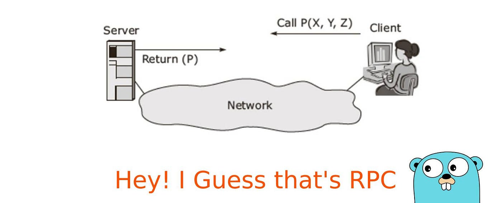
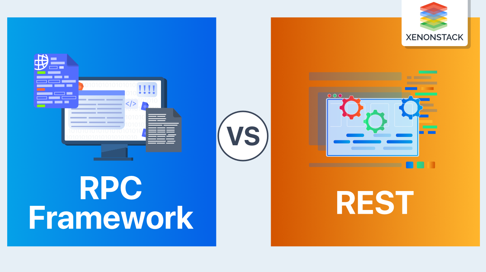
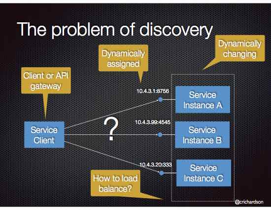
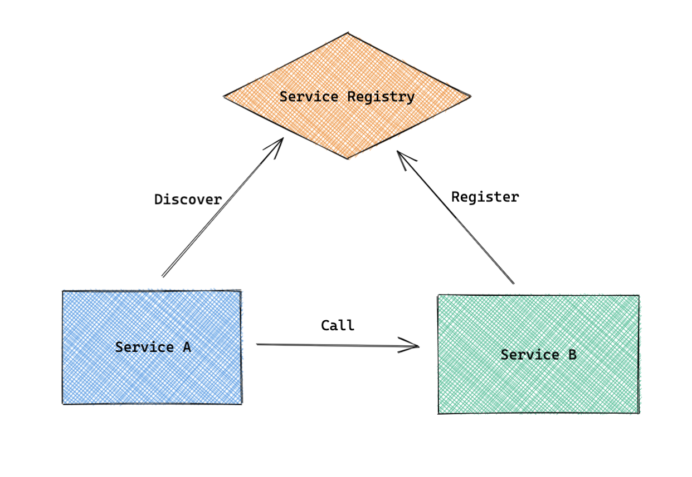
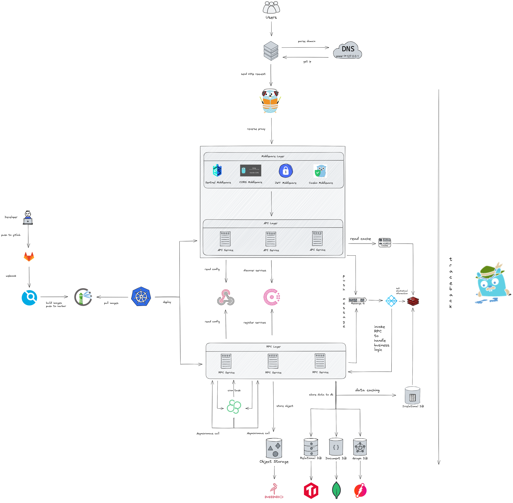

# 分布式 与 RPC 框架

## 什么是RPC框架？

### 什么是RPC

RPC是指远程过程调用,是Remote Procedure Call三个单词的缩写，功能就是本地的函数一样去调远程函数，远程一般是指通过网络从远程计算机程序上请求服务，也可以在在宿主机下通过网络进行不同架构下的互相请求服务。

在分布式或者微服务架构上非常常用，RPC让不同服务之间的服务调用像本地调用一样简单高效，RPC是一种网络协议，是一种规范，每个大厂几乎都有自己研发的RPC协议。

### 为什么要用RPC

如果我们开发简单的单一应用，逻辑简单、用户不多、流量不大，那我们用不着。

当我们的系统访问量增大、业务增多时，我们会发现一台单机运行此系统已经无法承受。此时，我们可以将业务拆分成几个互不关联的应用，分别部署在各自机器上，以划清逻辑并减小压力。此时，我们也可以不需要RPC，因为应用之间是互不关联的。

当我们的业务越来越多、应用也越来越多时，自然的，我们会发现有些功能已经不能简单划分开来或者划分不出来。此时，可以将公共业务逻辑抽离出来，将之组成独立的服务Service应用 。而原有的、新增的应用都可以与那些独立的Service应用 交互，以此来完成完整的业务功能。

所以此时，我们急需一种高效的应用程序之间的通讯手段来完成这种需求，服务之间的调用需要各种场景和因素的考虑，内部原理非常复杂和繁琐，同时在集群情况下，服务的负载均衡，熔断，限流等都是需要去考虑的，这时候就需要一个集服务注册发现、负载均衡、序列化协议、RPC通信协议、Socket通信、异步调用、熔断降级等技术为一体的技术去完成这些公共功能，所以你看，RPC大显身手的时候来了！

其实描述的场景也是服务化 、微服务和分布式系统架构的基础场景。即RPC框架就是实现以上结构的有力方式。

### 为什么不用HTTP

为什么有HTTP还需要RPC呢？RPC那么复杂为什么不用HTTP请求.

首先需要指正，这两个并不是并行概念。RPC 是一种**设计**，就是为了解决**不同服务之间的调用问题**，完整的 RPC 实现一般会包含有 **传输协议** 和 **序列化协议** 这两个。

而 HTTP 是一种传输协议，RPC 框架完全可以使用 HTTP 作为传输协议，也可以直接使用 TCP，使用不同的协议一般也是为了适应不同的场景。

RPC主要是为了解决特定的问题或者节约成本的角度出发的。

使用 TCP 和使用 HTTP 各有优势：

**传输效率**：

- TCP，通常自定义上层协议，可以让请求报文体积更小
- HTTP：如果是基于HTTP 1.1 的协议，请求中会包含很多无用的内容

**性能消耗**，主要在于序列化和反序列化的耗时

- TCP，可以基于各种序列化框架进行，效率比较高
- HTTP，大部分是通过 json 来实现的，字节大小和序列化耗时都要更消耗性能

**跨平台**：

- TCP：通常要求客户端和服务器为统一平台
- HTTP：可以在各种异构系统上运行

**总结**：
  RPC 的 TCP 方式主要用于公司内部的服务调用，性能消耗低，传输效率高。HTTP主要用于对外的异构环境，浏览器接口调用，APP接口调用，第三方接口调用等。

Google有一个著名的GRPC协议。GRPC底层就是http2协议，因为http1包含了太多的没用的信息，很浪费网络资源。因为大厂一般都会根据自己的系统架构自定义RPC协议，但是缺点就是缺乏灵活性。序列化协议常见的是json，protobuf，thrift，后面会讨论下这个序列化协议。

### 框架需要解决的问题

RPC是指远程过程调用，也就是说两台服务器A，B，一个应用部署在A服务器上，想要调用B服务器上应用提供的函数/方法，由于**不在一个内存空间，不能直接调用**，需要通过网络来表达调用的语义和传达调用的数据。

比如说，一个方法可能是这样定义的：func GetUserProfile(userId int64) *Profile
 那么：

第一，**首先，要解决通讯的问题**，主要是通过在客户端和服务器之间建立TCP连接（socket），远程过程调用的所有交换的数据都在这个连接里传输。连接可以是按需连接，调用结束后就断掉，也可以是长连接，多个远程过程调用共享同一个连接。

第二，**要解决寻址的问题**，也就是说，A服务器上的应用怎么告诉底层的RPC框架，如何连接到B服务器（如主机或IP地址）以及特定的端口，方法的名称名称是什么，这样才能完成调用。

第三，当A服务器上的应用发起远程过程调用时，方法的参数需要通过底层的网络协议如TCP传递到B服务器，由于网络协议是基于二进制的，内存中的参数的值要序列化成二进制的形式，也就是**序列化**（Serialize）或编组（marshal），通过寻址和传输将序列化的二进制发送给B服务器。

第四，B服务器收到请求后，需要对参数进行反序列化（序列化的逆操作），恢复为内存中的表达方式，然后找到对应的方法（寻址的一部分）进行本地调用，然后得到返回值。

第五，返回值还要发送回服务器A上的应用，也要经过序列化的方式发送，服务器A接到后，再反序列化，恢复为内存中的表达方式，交给A服务器上的应用

**总的来说可以归纳为以下几步：**

1. 远程服务之间建立通讯协议
2. 寻址：服务器（如主机或IP地址）以及特定的端口，方法的名称名称是什么
3. 通过序列化和反序列化进行数据传递
4. 将传递过来的数据通过java反射原理定位接口方法和参数
5. 暴露服务：用map将寻址的信息暴露给远方服务（提供一个endpoint *URI或者一个前端展示页面*）
6. 多线程并发请求业务

### 基本组成

RPC框架需要的最基本的三个要素：

- ServiceProvider: 服务提供方，提供相关服务接口。
- ServiceConsumer: 服务消费方，消费服务提供方的接口。
- Registry: 注册中心，用于进行服务的注册、发现、治理、高可用。

#### 注册中心

注册中心是RPC框架中的管理者和协调者角色，虽然在远程过程调用中服务消费者会不经过注册中心，会直接向服务提供者发送请求，但是随着我们的服务方越来越多，每个服务的实例也不断变化的，且每个服务的地址，端口等信息是需要通知到消费方的，所以我们需要一个类似“管家”的角色，来负责管理服务注册和发现的工作，这个“管家”我们称之为注册中心。

一个合格的注册中心需要具备包括缓存和持久化服务提供方数据，动态更新服务提供者信息，动态监听服务提供方节点变化，推送节点变化到消费方，查询服务提供方数据等功能。

#### 服务提供方（RPC服务端）

其需要对外提供服务接口，一个服务方需要包括启动连接注册中心，注册相关信息到注册中心，提供服务下线和更新机制，维护服务名和服务的映射，序列化和反序列化，启动通信等。

#### 服务消费方（RPC客户端）

服务消费方需要具备可以从注册中心拉取服务列表，缓存服务列表，动态监听和更新服务列表的功能，还需要具备针对于服务的负载均衡策略，序列化和反序列化，根据约定的通信协议进行调用等。

#### 实际组成

### 框架

#### gRPC

gRPC是一个高性能、通用的开源RPC框架，其由Google 2015年主要面向移动应用开发并基于HTTP/2协议标准而设计，基于ProtoBuf序列化协议开发，且支持众多开发语言。

**教程**

[写给go开发者的gRPC教程-protobuf基础](https://juejin.cn/post/7191008929986379836)

[gRPC 官网](https://grpc.io/docs/languages/go/quickstart/)

[protobuf 官网](https://protobuf.dev/overview/)

#### thrift

Thrift 最初是由 Facebook 作为内部项目开发使用，于 2007.04 开源，2008.05 进入 Apache 孵化器，并于 2010.11 成为 Apache 顶级项目（Top-Level Project, TLP）, 至今已有 10+ 年，thrift 功能强大，使用二进制进行传输，速度更快。

**教程**

[Thrift & IDL 介绍](https://juejin.cn/post/6844903971086139400)

[Thrift序列化协议浅析](https://andrewpqc.github.io/2019/02/24/thrift/)

[Thrift 官网](https://thrift.apache.org/)

#### 性能比较

整体上看，长连接性能优于短连接，性能差距在两倍以上；

对比Go语言的两个RPC框架，Thrift性能明显优于gRPC，性能差距也在两倍以上；

对比Thrift框架下的的两种语言，长连接下Go 与C++的RPC性能基本在同一个量级，在短连接下，Go性能大概是C++的二倍；

对比Thrift&C++下的TSimpleServer与TNonblockingServer，在单进程客户端长连接的场景下，TNonblockingServer因为存在线程管理开销，性能较TSimpleServer差一些；但在短连接时，主要开销在连接建立上，线程池管理开销可忽略；

两套RPC框架，以及两大语言运行都非常稳定，5w次请求耗时约是1w次的5倍；

#### 如何选型

什么时候应该选择gRPC而不是Thrift：

- 需要良好的文档、示例
- 喜欢、习惯HTTP/2、ProtoBuf
- 对网络传输带宽敏感

什么时候应该选择Thrift而不是gRPC：

- 需要在非常多的语言间进行数据交换
- 对CPU敏感
- 协议层、传输层有多种控制要求
- 需要稳定的版本
- 不需要良好的文档和示例

#### 总结

- GRPC主要就是搞了个ProtoBuf，然后采用HTTP协议，所以协议部分没有重复造轮子，重点就在ProtoBuf上。
- Thrift的数据格式是用的现成的，没有单独搞一套，但是它在传输层和服务端全部是自己造轮子，所以可以对协议层、传输层有多种控制要求。

## 框架介绍

### go-zero

[GitHub](https://github.com/zeromicro/go-zero)

[官方文档](https://go-zero.dev/cn/docs/introduction)

[go-zero-looklook](https://github.com/Mikaelemmmm/go-zero-looklook)

[go-zeoro API 语法](https://go-zero.dev/cn/docs/design/grammar)

### Kitex

[Kitex 文档](https://www.cloudwego.io/docs/kitex/)

[biz-demo](https://github.com/cloudwego/biz-demo)

## 作业

使用任意RPC框架重构《第三节课 gin 框架与中间件入门》作业中的项目

## 作业提交事项

**提交地址**：a@stellaris.wang

**提交格式**：第十一次作业-202221xxxx-stellarisw

**截止时间**：下一次上课之前

## 参考链接

[什么是RPC？RPC好处？常用的RPC框架？](https://juejin.cn/post/6844904126531256328)

[带你手把手实操一个RPC框架](https://juejin.cn/post/7176557545367011385)

[初探远程过程调用RPC（一.了解RPC框架协议）](https://juejin.cn/post/7038180582890668040)

[什么是RPC，你知道嘛？](https://zhuanlan.zhihu.com/p/139688497)

[【RPC基础系列2】一文搞懂gRPC和Thrift的基本原理和区别](https://juejin.cn/post/6984961473378271245#heading-2)