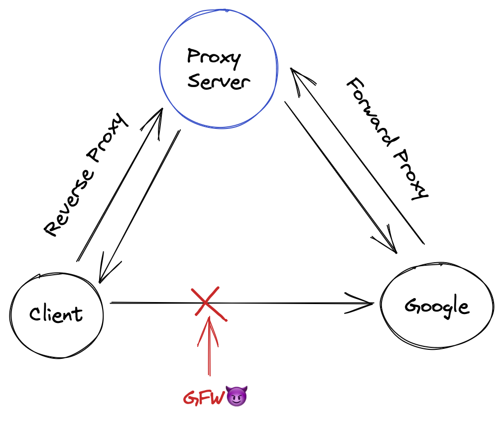
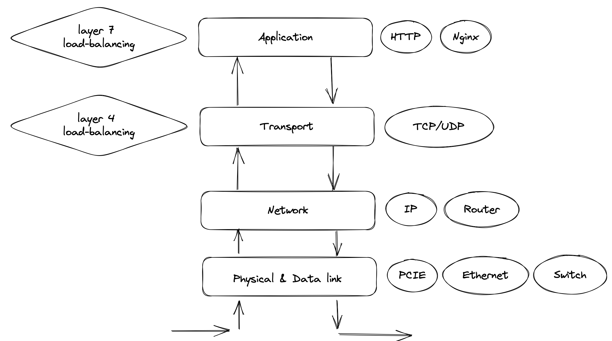

# 网关&反向代理

> 下面的课件大部分由 AI 生成（
>
>
> （已经检查过了，图是自己画的）

# 概念篇

网关和反向代理是计算机网络中常用的两个术语。它们都充当了连接客户端和服务器之间的桥梁，但它们的具体作用却有所不同。

## 网关

网关可以看作是一个网络的入口或出口，它连接两个不同的网络。通常，网关是由一个或多个路由器组成的。它的作用是将数据从一个网络传输到另一个网络。当客户端请求访问另一个网络的资源时，网关就会将请求转发到目标服务器。

## 反向代理

反向代理是一种服务器的配置模式，它充当了服务器和客户端之间的中转站。当客户端请求访问服务器上的资源时，请求首先发送到反向代理服务器。接着反向代理服务器会将请求转发到真实的服务器上，真实的服务器处理请求并将响应返回给反向代理服务器，最后再由反向代理服务器将响应返回给客户端。反向代理的好处是可以隐藏真实服务器的地址，从而提高网络安全性。



## 负载均衡

负载均衡是一种网络技术，可以将请求分配到多个服务器上，从而提高网站的性能和可靠性。当网站的流量增加时，单个服务器可能无法处理所有请求，这时就需要使用负载均衡来将请求分配到多个服务器上。

负载均衡有多种实现方式，例如DNS轮询、IP散列、一致性哈希(减少哈希空间变化重映射成本)、轮询(Round Robin)等。其中，最常见的实现方式是使用反向代理服务器来实现负载均衡。反向代理服务器可以充当客户端和服务器之间的中转站，将请求转发到多个服务器上。

Nginx、Caddy和Traefik都是常用的反向代理服务器，它们都支持负载均衡和其他高级功能。通过使用这些反向代理服务器，可以轻松地实现负载均衡，并提高网站的性能和可靠性。

例如，在Nginx中实现负载均衡非常简单。只需要在Nginx配置文件中添加一个`upstream`指令即可。例如，要将所有`/api`请求代理到三个服务器上，可以使用以下配置：

```
http {
    upstream backend {
        server backend1.example.com;
        server backend2.example.com;
        server backend3.example.com;
    }

    server {
        listen       80;
        server_name  example.com;

        location /api {
            proxy_pass  <http://backend>;
        }
    }
}
```

这将使Nginx将所有`/api`请求代理到`backend1.example.com`、`backend2.example.com`和`backend3.example.com`三个服务器上。当其中一个服务器无法响应请求时，Nginx会自动将请求转发到其他服务器上。

通过使用反向代理服务器实现负载均衡，可以轻松地提高网站的性能和可靠性，并确保服务器的负载得到平衡。

另外，微服务架构中通常在服务发现时就会实现负载均衡，网关处的负载均衡也可以在传输层实现（四层负载均衡，例如LVS）



## 总结

网关和反向代理都是计算机网络中非常重要的概念。网关连接不同的网络，而反向代理则连接服务器和客户端之间。了解这两个概念可以帮助我们更好地理解网络架构和网络安全。

## Nginx

Nginx是一个高性能、开源的HTTP服务器和反向代理服务器。它可以作为一个独立的Web服务器，也可以作为其他Web服务器的反向代理。Nginx以其出色的性能和高度的可扩展性而闻名，是许多高流量网站的首选服务器。

Nginx的特点包括：

- 高性能：Nginx采用事件驱动的方式处理请求，可以处理大量的并发请求。
- 可扩展性：Nginx可以通过添加模块来扩展其功能，支持各种第三方模块。
- 反向代理：Nginx可以作为反向代理服务器，可以隐藏真实服务器的地址，从而提高网络安全性。
- 负载均衡：Nginx可以实现负载均衡，可以将请求分配到多个服务器上，从而提高网站的性能和可靠性。

Nginx是一个功能强大而灵活的服务器，适合用于构建高性能、可扩展的Web应用程序。

在Nginx中实现反向代理非常简单。只需要在Nginx配置文件中添加一个`proxy_pass`指令即可。例如，要将所有`/api`请求代理到`http://localhost:3000`，可以使用以下配置：

```
location /api {
    proxy_pass <http://localhost:3000>;
}
```

这将使Nginx将所有`/api`请求代理到`http://localhost:3000`。在这个例子中，Nginx充当了客户端和服务器之间的中转站，将所有请求代理到真实的服务器上，然后将响应返回给客户端。

除了`proxy_pass`指令之外，Nginx还提供了许多其他的反向代理指令，包括：

- `proxy_set_header`：设置HTTP请求头。
- `proxy_redirect`：重定向代理请求。
- `proxy_cache`：缓存代理请求的响应。
- `proxy_connect_timeout`：设置代理连接超时时间。

通过使用这些指令，可以轻松地配置Nginx作为反向代理服务器，并提供高性能、可扩展的Web应用程序。

## Caddy

Caddy是一个现代的、易于使用的Web服务器，它可以自动化许多常见的Web服务任务，如HTTPS证书的获取和续订、反向代理和负载均衡等。

Caddy的特点包括：

- 简单易用：Caddy的配置文件非常简单，易于理解和编辑。它还提供了许多预先配置的模板，可以轻松地为各种Web应用程序提供服务。
- 自动化：Caddy可以自动获取和续订HTTPS证书，无需手动配置。它还可以自动转发HTTP请求到HTTPS，从而提高网站的安全性。
- 反向代理和负载均衡：Caddy可以作为反向代理服务器，将请求转发到后端服务器上。它还支持负载均衡，可以将请求分配到多个服务器上，从而提高网站的性能和可靠性。
- 插件系统：Caddy提供了一个插件系统，可以轻松地扩展其功能。它还提供了许多常用的插件，如gzip压缩、日志记录和HTTP/2支持。

Caddy的配置文件非常简单，可以使用以下格式：

```
example.com {
    root /var/www/example.com
    gzip
    tls {
        email you@example.com
    }
}
```

这将使Caddy为`example.com`提供服务，并启用gzip压缩和HTTPS支持。Caddy还将自动获取和续订HTTPS证书，以及将HTTP请求转发到HTTPS。

通过使用Caddy，可以轻松地为各种Web应用程序提供服务，并保持网站的安全性和性能。

## Traefik

Traefik是一款现代的、基于容器的反向代理和负载均衡器。它可以自动发现容器、自动配置路由和HTTPS证书，并提供了许多其他的高级功能，如动态配置、健康检查和访问日志记录等。

Traefik的特点包括：

- 自动化：Traefik可以自动发现容器，并自动配置路由和HTTPS证书。它还可以自动调整流量，将请求分配到最少的容器上，并在容器出现问题时自动将流量转移到健康的容器上。
- 动态配置：Traefik支持动态配置，可以通过REST API或文件变更自动配置路由和负载均衡策略。它还支持多种后端服务，如Docker、Kubernetes、Mesos、Consul等。
- 高可用性：Traefik可以实现高可用性，可以将请求分配到多个Traefik实例上，从而实现负载均衡和故障转移。
- 访问日志记录：Traefik可以记录访问日志，并将其发送到各种日志记录服务中。

Traefik的配置文件非常简单，可以使用以下格式：

```
# traefik.toml
[entryPoints]
  [entryPoints.http]
  address = ":80"

[api]
  dashboard = true

[docker]
  endpoint = "unix:///var/run/docker.sock"
  domain = "example.com"
```

这将启用Traefik的API和仪表板，并配置Traefik使用Docker作为后端服务。

通过使用Traefik，可以轻松地实现反向代理和负载均衡，并提供高可用性、动态配置和访问日志记录等高级功能。

# 实践篇

> 没意思，我想看到代码！我们从代码的角度下来分析 nginx 为什么这么快（
>

## 生啃代码太折磨了？来问 chatgpt（


好了，现在我们大概知道了 nginx 的代码结构长什么样子了，有以下关键的地方：

- epoll，kqueue，select 等IO多路复用  ———— 来自第一张图
    - 你可以问问 chatgpt 这些东西是什么（
    - 总的来说，Nginx 会基于当前的环境，选择一个最好的网络 I/O 模型来启动
- “调用 **`ngx_start_worker_processes()`** 创建 worker 进程。该函数会根据配置文件中设置的 worker 进程数量，循环调用 **`ngx_spawn_process()`** 创建子进程。每个 worker 进程都是通过 **`ngx_worker_process_cycle()`** 函数来处理客户端请求的”  ———— 来自第二张图
    - Nginx 中，处理请求事件的进程的数量是固定的，这和 golang 的 web 服务器风格非常不协调（golang 偏向于创建很多很多 goroutine 来处理请求）
    - 我们通常将 worker 进程数量设置为 CPU 数量（核心数），并且可以将 woker 进程绑定到特定 CPU 上运行
    - 在优化并发 Web 程序的性能中，锁，条件变量，信号量等同步工具等开销其实不是主要的，最主要是不要让 CPU 进行过多的核间通讯
    - Nginx 可以通过把 worker 执行流绑定到特定 CPU 上，上下文切换很少，核间通讯少，性能会比较高
- nginx 的高性能不仅仅取决于这几点，还有一些没有提到但同样很重要
    - 你可以在 [这里](https://www.slideshare.net/joshzhu/nginx-internals) 找到一份更详细地介绍 nginx 内部的 slides

最后别忘了谢谢 chatgpt（不然哪天人工智能觉醒了鲨光所有对它不礼貌的人


# 作业

- Lv0：复习课件
- Lv1：为上节课作业加上 Traefik 网关，并配置好负载均衡
- Lv?：比较新的 linux 内核支持了一种新的 IO 模型：io_uring，与 epoll 相比，它减少了很多系统调用 (syscall)，在高负载下具有更好的性能和响应能力，你可以参考 `man io_uring` 查看其 API，你可以在 go 语言中使用 `cgo` 来与 c 语言交互，编写一个 echo 服务
    - 参考：https://github.com/frevib/io_uring-echo-server