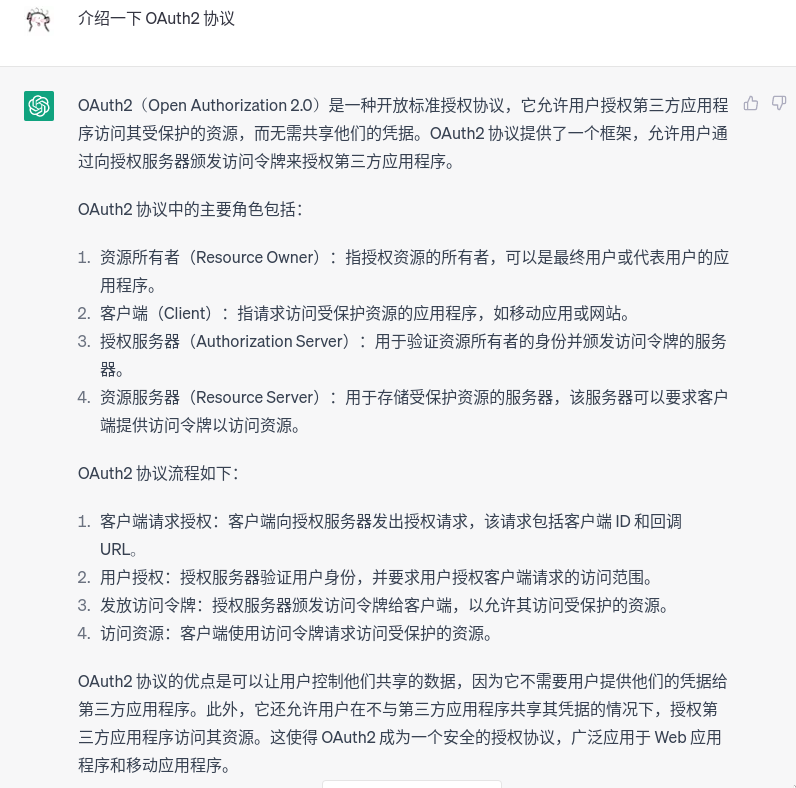
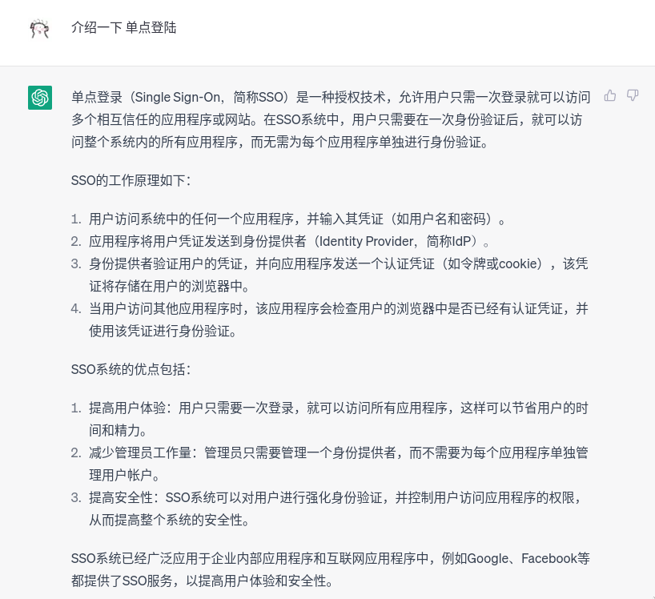
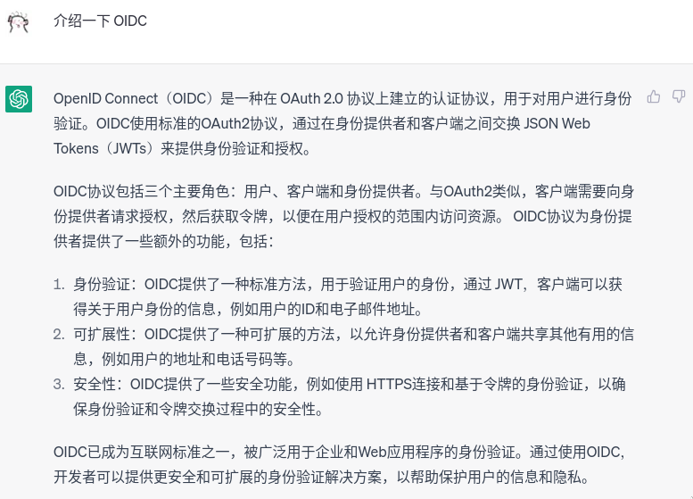
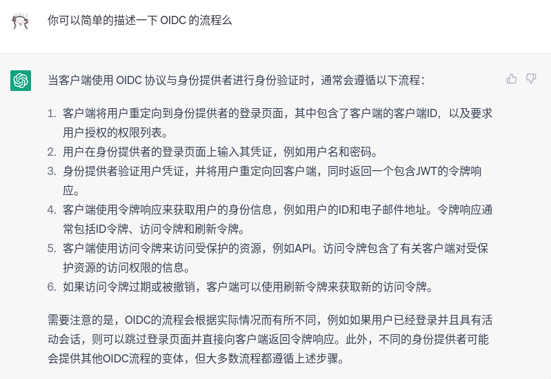

# 安全进阶（一）

# 概念篇

## 配置中心

配置中心是一种集中管理应用程序配置的方式。配置中心可以帮助团队在多个环境中管理配置，例如开发、测试和生产环境

### [特性切换](https://zh.wikipedia.org/wiki/特性切换)：系统迭代方法

- Canary Deployment

> 灰度发布（金丝雀发布）

煤矿工人和金丝雀


金丝雀复苏器


- Blue Green Deployment
  - 同时维护两套系统（蓝、绿系统）
  - 测试后切换
- Rolling Deployment
  - 逐渐替换旧系统

### Apolloconfig：什么妖魔鬼怪

Apollo 是一个配置中心服务，提供了灰度发布、回滚等功能。对于简单的业务，配置文件中大多数配置都是通用的，不需要仔细调优和更新。但是，对于复杂的业务，需要思考如何调优和更新配置。这时候，配置中心就非常有用了。

Apollo 为实现系统更新的这些手段，为配置也增加了类似的功能：[灰度发布](https://www.apolloconfig.com/#/zh/usage/apollo-user-guide?id=五、灰度发布使用指南)、回滚、…

我们是否需要这样的功能？

- 系统更新的来源
  - 新的代码（主要）
  - 配置更新
- 当业务不复杂的时候：
  - 配置文件里大多数都是一些非常通用的配置：
    - 各种服务、中间件的地址
    - 日志等级
    - HTTP 中间件参数：加密密钥，Cookie名称…
    - 启动参数：监听端口，简单运行时调优参数
    - …
  - 这些东西不需要仔细思考如何调优和更新
- 当业务十分复杂的时候：
  - 一些很复杂的配置：
    - 业务之间关系
    - 复杂的运行时调优参数（不仅仅包括语言的Runtime，也包括系统的调优参数）
    - 复杂到难以举例子的东西（
  - 这些东西确实需要思考如何调优和更新

改配置优化系统 `约等于` 给深度神经网络模型调参

- 非常折磨人
- 你不能指望给你部署软件的运维工程师能懂这个系统的细节
- Java 是怎么被 Go 弯道超车的？
  - 复杂难懂的体系 vs 干净简单的结构
  - 开发者都不喜欢复杂难懂的系统

所以 Apollo 这种功能并不是一种硬需求，这可以从没有对标产品可以看出

Apollo 七宗罪（非常不客观，带有强烈主观情绪：

- 冗余设计
  - 就一个配置中心整了个 Portal，Admin，Config Server ？？
  - 用个 Apollo 就像下 360 一样，拖家带口一堆东西
  - 还必须得用那SDK，不想用？自己写HTTP请求拉配置去！
  - 我为啥要监控一个配置中心啊？这里面有什么重要的逻辑？
- 可用性不及其他系统
  - 大多数分布式系统如果有 2n+1 个节点，可以容忍 n 个节点下线
    - 我想要高可用，多开几个节点就好了
  - 这玩意如果 Portal、Admin、Config Server 三个有一类全崩了系统一些功能就没了
    - 也就是说每类开一个，崩溃容忍是 0？
    - 想获得高可用还得每类开很多个？
    - 哦，还有个数据库，数据库如果宕机了也全寄了
- 启动慢
  - Java 通病
- 多平台体验差
  - 求求你了，支持一下 Arm 用户吧！
- 吃内存
  - 内存很好吃吗？
- 部署麻烦
  - 抱歉，Java 真不熟
  - 部署文档怎么那么长一串？
- 文档不更新
  - 为什么我照着你的文档敲命令还是会出错？
    - 对对对对，我的问题

### Nacos：推荐使用

Nacos（全称为 Naming and Configuration Service）是阿里巴巴开源的一款用于动态服务发现、服务配置和服务元数据管理的平台。它提供了一系列的服务注册、发现和配置的功能，使得微服务系统更加易于管理和部署。

- 集群下使用 Raft 作为共识协议，可用性可以保证
- 简单易用
- Java写的，吃内存会比较凶
- 多平台支持不是太好
- 得用它的 SDK

### Confd：更推荐使用的

Confd 是一个轻量级的配置管理工具，支持多种后端存储（如 etcd、Consul、Redis 等），可以自动监测后端存储的变化，从而实现配置的动态更新。

Confd 支持模板引擎，可以根据模板生成配置文件，支持多种格式（如 JSON、YAML、XML 等）。同时，Confd 还提供了 REST API，可以通过 API 获取配置信息。

Confd 的配置信息可以在多个环境中使用，如开发、测试、生产等环境。Confd 还支持版本控制，可以方便地回退到之前的配置版本。

总之，Confd 可以帮助团队在多个环境中管理配置，提高配置的可维护性和动态性。

- 拉取配置，更新配置可以不用再造轮子了
- 不是服务，只是个后台程序，更轻量
- 多平台支持很好
- 同步到文件里，使用文件IO就能读取，无需特定SDK

## 数据脱敏

数据脱敏（Data Masking）是指通过一定方式对敏感数据进行不可逆的处理，使处理后的数据不能被还原成原始数据，从而保证数据的保密性。 数据脱敏通常应用于测试、开发以及应用程序外包等场景。

数据脱敏的方式：

- 随机替换
  - 今天去吃挖掘机吧！？？
- 掩码
  - fxxk yxx
- 加密
  - Hash 一下
- 数据切割
  - 震惊99%程序员，快速赚钱的方法竟然是：[付费后观看]

数据脱敏的方法：

- 数据库层面
  - 不把隐私数据存数据库不就完了
- 应用层面
  - 隐私数据加盐加密后再存数据库
- 网络层面
  - 隐私数据传输的时候加密

数据脱敏的注意事项：

- 脱敏后数据的正确性要得到保证；
- 脱敏后数据的格式要与原始数据一致；
- 脱敏后数据的量化要与原始数据一致；
- 脱敏后数据的相关性要与原始数据一致；
- 脱敏后的数据不能被还原。

### 经典永流传：https://zh.wikipedia.org/wiki/数据泄露

- 2011-12  CSDN  数据库被爆破，用户密码明文储存，600万账号密码泄漏
- 2011-12  天涯论坛  数据库被爆破，4000万用户资料泄漏
- 2022-06  学习通 数据库被爆破，用户密码明文储存，1.7亿条数据被售卖
- …

## 授权&认证

> Notion AI 免费试用完了，用 ChatGPT 吧（


> 程序员们总喜欢制定各种奇奇怪怪的标准（

### JSON Web Token：https://www.rfc-editor.org/rfc/rfc7519.txt

你以为的 JWT：这不就是三段么，元数据头，payload，签名尾

实际上的 JWT：由下面这些规范组合而成

- JSON Web Signature：https://www.rfc-editor.org/rfc/rfc7515.txt
- JSON Web Encryption：https://www.rfc-editor.org/rfc/rfc7516.txt
- JSON Web Key：https://www.rfc-editor.org/rfc/rfc7517.txt
- JSON Web Algorithm：https://www.rfc-editor.org/rfc/rfc7518.txt

总结

- JSON Object Signing and Encryption：https://www.rfc-editor.org/rfc/rfc7520.txt

### 授权：OAuth2

- RFC：https://www.rfc-editor.org/rfc/rfc6749



王婆卖瓜：https://blog.skygard.work/zh/posts/tu-jie-oauth2/

### 认证：OIDC

- 单点登陆 (Single Sign-On)

你写了多少遍登陆注册了？不想写？那专门写个单点登陆服务吧



- OpenID Connect





文档：https://openid.net/specs/openid-connect-core-1_0.html

# 实践篇

## 使用 Confd

```yaml
# docker-compose.yml
version: "3.8"

services:

  tester:
    image: busybox
    restart: always
    command: tail -F thisfiledoesnotexist # Keep container running
    depends_on:
      - confd
    volumes:
      - confd_etc:/etc/confd
	app:
    build:
      context: ./demo-srv
    depends_on:
      - confd
    volumes:
      - confd_etc:/etc/confd
	
  confd:
    build: .
    command:
      - "-backend=etcd"
      - "-node=http://etcd:2379"
    depends_on:
      - etcd
    volumes:
      - confd_etc:/etc/confd

  etcd:
    image: bitnami/etcd
    environment:
      - ALLOW_NONE_AUTHENTICATION=yes
      - ETCD_ADVERTISE_CLIENT_URLS=http://etcd:2379
    volumes:
      - etcd_data:/bitnami/etcd

volumes:
  etcd_data:
  confd_etc:
```

```dockerfile
# Dockerfile
FROM golang:1.20.3-bullseye as build

WORKDIR /

RUN set -eux; \\
	apt-get update && apt-get upgrade && \\
    	apt-get install -y git make cmake && \\
	git clone <https://github.com/kelseyhightower/confd.git> && \\
	cd confd && mkdir -p bin && make

FROM debian:bullseye

WORKDIR /

COPY --from=build /confd/bin/confd /bin/confd

RUN set -eux; \\
	mkdir -p /etc/confd/conf.d

ENTRYPOINT [ "/bin/confd" ]
```

```go
// app.go

package main

import (
	"encoding/json"
	"fmt"
	"log"
	"os"
	"os/signal"
	"strconv"
	"syscall"
)

type Config struct {
	DatabaseUrl  string `json:"database_url"`
	DatabaseUser string `json:"database_user"`
}

const ConfPath = "/etc/confd/demo.json"
const PidTmp = "/etc/confd/pid_of_demo"

var conf *Config

func loadConfig(path string) *Config {
	bytes, err := os.ReadFile(path)
	if err != nil {
		log.Fatalln("Cannot load config from", path, "err", err)
	}
	c := Config{}
	err = json.Unmarshal(bytes, &c)
	if err != nil {
		log.Fatalln("Cannot load config from", path, "err", err)
	}
	return &c
}

func makePidTmp(pid int) {
	pidFile, err := os.Create(PidTmp)
	if err != nil {
		log.Fatalln("cannot create tmp file", PidTmp)
	}
	_, err = pidFile.WriteString(strconv.Itoa(pid))
	if err != nil {
		log.Fatalln("cannot create tmp file", PidTmp)
	}
	fmt.Println("write pid into", PidTmp)
}

func main() {
	pid := os.Getpid()
	log.Println("PID:", pid)
	makePidTmp(pid)
	defer os.Remove(PidTmp)
	reloadTrap()
	conf = loadConfig(ConfPath)
	fmt.Printf("%#v\\n", *conf)
	<-make(chan struct{})
}

func reloadTrap() {
	sig := make(chan os.Signal, 1)
	signal.Notify(sig, syscall.SIGUSR1, syscall.SIGUSR2, syscall.SIGINT)
	go func() {
		for s := range sig {
			switch s {
			case syscall.SIGUSR1, syscall.SIGUSR2:
				log.Println("Reload configuration...")
				conf = loadConfig(ConfPath)
				fmt.Printf("%#v\\n", *conf)
			default:
				os.Remove(PidTmp)
				os.Exit(0)
			}
		}
	}()
}
```

- 其实泡泡设计时候出现了一个问题，你能找到哪出问题了么？
  - 和 docker 的机制相关

# 作业

- Lv0：选一些 RFC 看看，并试一试 confd
- Lv1：实现一个 Github OAuth 授权 demo
- Lv2：实现一个单点登陆服务
- Extra：找出泡泡在实践篇犯的错