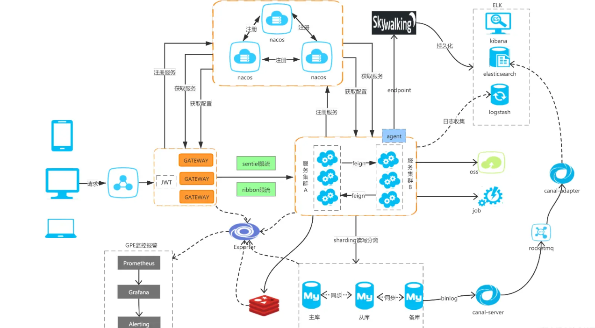
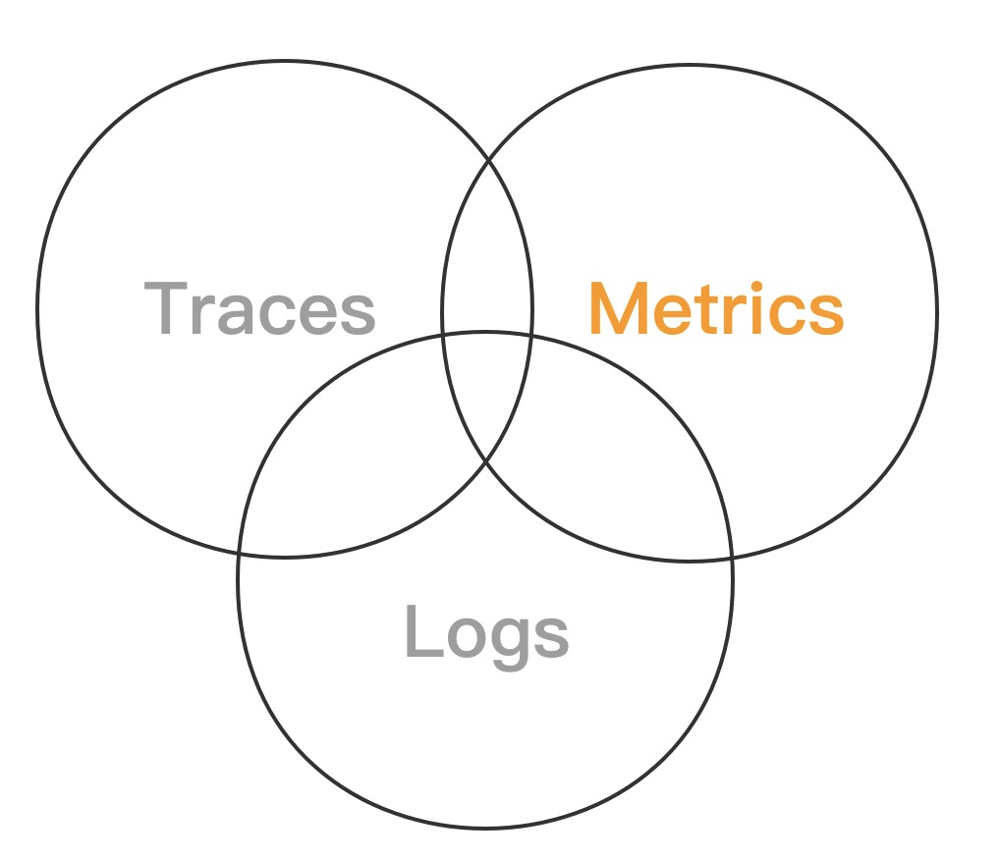
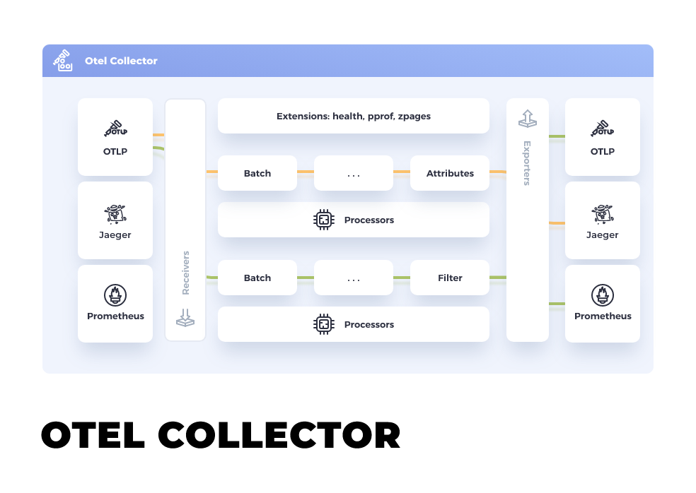
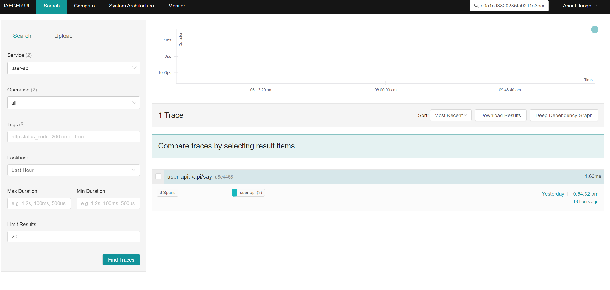
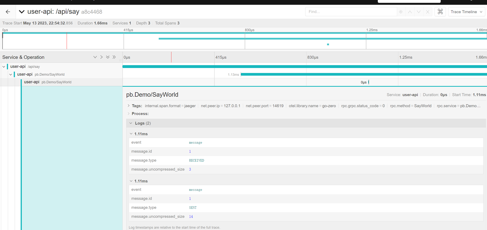

# **前言**

单从定位bug的角度出发，来思考我们今天的主题。

在传统的单体架构中，应用程序通常是以单个进程运行的，因此在调试或者在日志中，可以很轻松地跟踪和诊断问题。

但是微服务架构中，一个应用程序通常会被拆分成多个小型服务，这些服务可以分别运行在不同的计算机或容器中。由于每个服务都有自己独立的代码库和数据存储，因此在调试过程中，需要跨越多个服务来检查问题的根源。这种情况下，传统的DeBug或者日志排查就非常难受。



例如，假设我们有一个电子商务应用程序，其中包含一个购物车服务和一个支付服务。当用户向购物车中添加商品并尝试结账时，支付服务会被调用。如果用户报告说他们无法完成购买，我们需要检查购物车服务和支付服务之间的通信是否正常。

在这种情况下，我们可以使用OTel跟踪整个调用链路。当用户向购物车添加商品时，购物车服务会将数据发送到支付服务。我们可以在购物车服务和支付服务中添加OTel跟踪器，可以在调用链路上捕获关键数据，并将其发送到OTel数据收集器。通过这种方式，请求链路更加透明清晰，我们可以查看每个服务的性能指标，并快速确定是否存在问题。

# OpenTelemetry


## 前世

### OpenTracing&OpenSensus

在OpenTelemetry之前，有两个主要的开源项目分别是**OpenCensus**和**OpenTracing**，它们都是为了解决应用程序跟踪和度量的问题。

OpenCensus是由Google主导的一个开源项目，旨在为跨多种编程语言和平台的云原生应用程序提供度量、追踪和分布式跟踪的工具和库。它支持多种语言，并且可以与多个后端服务进行集成，例如Prometheus、Jaeger和Zipkin等。

而OpenTracing是由CNCF主导的一个开源项目，旨在为跨多种编程语言和平台的云原生应用程序提供分布式跟踪的工具和库。它也支持多种语言，并且可以与多个后端服务进行集成，例如Jaeger、Zipkin和LightStep等。

可以发现这两个玩意差不多.jpg

虽然OpenCensus和OpenTracing都在解决应用程序跟踪和度量的问题，但它们之间存在不兼容的问题，这使得开发人员在使用这两个工具时面临一些挑战。因此，为了解决这个问题，OpenCensus和OpenTracing在2019年合并为一个新的项目OpenTelemetry。

## 什么是 OpenTelemetry？

从官方 [What is OpenTelemetry?](https://opentelemetry.io/docs/concepts/what-is-opentelemetry/) 可了解到：

OpenTelemetry(OTel) 是 [CNCF ](https://www.cncf.io/projects/)的一个跨语言、跨平台的开源工具集(如trace、metrics、logs等)，旨在为应用程序提供分布式跟踪、日志记录和度量的功能。它由多个开源项目合并而来，包括OpenCensus和OpenTracing，提供了一组API和SDK，可以帮助开发人员在应用程序中嵌入跟踪器、日志记录器和度量器，并收集应用程序的性能数据。

​     从上面的OpenTracing和OpenSensus了解到，由于没有固定的标准，各个分布式追踪方案各显神通，使用不同的协议，不同的标准。OpenTelemetry的出现，提供了一系列的标准，并且他的可插拔式的架构为将来的协议和数据结构扩展提供了便利的方式。

**架构图**


## OpenTelemetry组件

1. OpenTelemetry API：提供了一组定义良好的API，用于在应用程序中创建Span、记录事件和属性、设置上下文信息等。
2. OpenTelemetry SDK：提供了一组实现OpenTelemetry API的工具，用于在应用程序中创建和管理Span、记录事件和属性、注入和提取Span Context等。
3. **OpenTelemetry Exporter**：提供了一组用于将OpenTelemetry数据导出到不同后端的工具，例如将跟踪数据导出到Zipkin、Jaeger等跟踪系统，将日志数据导出到Elasticsearch、Logz.io等日志系统，将指标数据导出到Prometheus、InfluxDB等指标系统。
4. OpenTelemetry Instrumentation：提供了一组自动化的仪表化工具，用于自动化地仪表化应用程序中的常见框架、库和组件，例如HTTP客户端、数据库驱动程序、消息队列等。
5. **OpenTelemetry Collecto**r：提供了一组用于收集、处理和导出OpenTelemetry数据的工具，可以自定义配置和插件，以便将数据转发到不同的后端。
6. **OpenTelemetry Protocol(OTelP)**：提供了一组定义良好的协议，用于在不同的OpenTelemetry组件之间传递数据，例如在应用程序和OpenTelemetry Collector之间传递Span数据。

- **OTLP/HTTP**

`OTLP/HTTP`在数据传输的时候支持两种模式：二进制和json

**二进制**使用`proto3`编码标准，且必须在请求头中标注`Content-Type: application/x-protobuf`

**JSON**格式使用`proto3`标准定义的`JSON Mapping`来处理`Protobuf`和`JSON`之间的映射关系。

- **OTLP/gRPC**

**普通请求**：在客户端和服务端建立连接后，客户端可以持续不断的发送请求到服务端，服务端会一一回应。 **并发****请求**：客户端可以在服务端未回应前发送下一个请求，以此提高并发量。

### **了解OTel组件前**

 **我们首先要知道下面几个概念**

### 可观测性（observability）



#### 什么是可观察性？

官网对于可观测性的描述 [Observability Primer](https://opentelemetry.io/docs/concepts/observability-primer/#what-is-observability)

可观察性让我们从外部了解一个系统，让我们在不知道其内部运作的情况下就该系统提出问题。此外，使我们能够轻松解决和处理新问题（即“未知的未知数”），并帮助我们回答“为什么会发生这种情况？”的问题。

为了能够询问系统的这些问题，必须对应用程序进行适当的检测。也就是说，应用程序代码必须发出 traces、 metrics和 logs等 signals。当开发人员不需要添加更多工具来解决问题时，应用程序会被正确地检测，因为他们拥有所需的所有信息。

- **Log**

记录系统运行时产生的各种日志数据，包括错误、警告、信息等。

- **Metric**

收集和记录各种系统指标数据，例如请求次数、响应时间、错误率等。

- **Traces**

跟踪应用程序的请求路径和性能瓶颈，以便更好地理解和分析应用程序的性能和运行状态

### Context Propagation

在OTel中，Context Propagation（上下文传播）是一种机制，用于在分布式系统中传递上下文信息，包括Span Context和其他相关信息，以便在不同的服务之间追踪请求、记录日志和采集指标，他供了一组标准化的API和协议，以便在不同的服务之间传递上下文。

### Trace

用于收集、存储和展示应用程序的分布式跟踪数据。Trace由Span（跨度）和TraceContext（跨度上下文）两个部分组成，一个trace是spans的有向无环图。

TraceContext（跟踪上下文）是一种用于在分布式系统中传递跟踪信息的标准格式。TraceContext包含了跟踪ID（Trace ID）、跨度ID（Span ID）、父级跨度ID（Parent Span ID）等属性，用于跨越多个服务和跨度，标识跨度的唯一标识符和关系。

以下是TraceContext中常见的属性：

- Trace ID：用于标识整个跟踪过程的唯一标识符。每个Span都属于一个Trace ID。
- Span ID：用于标识Span的唯一标识符。Span ID必须在同一个Trace ID下唯一。
- Parent Span ID：用于标识Span的父级Span ID。如果一个Span是另一个Span的子Span，则它的Parent Span ID将指向父Span的Span ID。
- Trace Flags：用于指示跟踪信息的采样率和标志。例如，Trace Flags可以指示是否对Span进行采样，以及是否启用调试模式等。
- Trace State：用于传递Span之间的一些上下文信息，例如用户ID、请求ID等。Trace State可以用于在跨度之间传递自定义信息，以便更好地理解和分析跟踪数据。

### Metric

用于收集、存储和展示应用程序的度量数据。Metric（度量）包括Counter（计数器）、Gauge（仪表盘）和Histogram（直方图）三种类型，可以用于记录应用程序的性能指标，例如请求响应时间、内存使用率和CPU负载等，它可以将采集到的指标数据导出到各种目标系统，例如**Promethe**

### Span

Span在调用链中是一个基础的单元，一个调用链是由很多的Span组成的。

Span表示应用程序中的一个操作或事件，例如HTTP请求、数据库查询或RPC调用等。Span包括一些元数据信息，例如操作名称、起始时间和持续时间等，以及一些标签和注释，用于描述Span的上下文和特征。

在Span中一般会包含如下信息:

1. Span Context 
2. Span name
3. Span Kind
4. 开始与结束时间戳
5. Span状态
6. Attributes
7. Span event
8. Span Links

- Span Json 样例

- ```JSON
    {
      "trace_id": "f4a32b2f8a064e4c9fda7e2e5fba5b16",
      "span_id": "d7a3dbeb57f8dc1a",
      "parent_span_id": "c1e5c5c8e8a3d50f",
      "name": "HTTP GET /api/users",
      "kind": "SERVER",
      "start_time": "2022-05-12T10:30:00Z",
      "end_time": "2022-05-12T10:30:01Z",
      "duration": 1000000000,
      "status": {
        "code": "OK",
        "message": ""
      },
      "attributes": {  
        "http.method": "GET",
        "http.url": "/api/users",
        "http.status_code": 200
      },
      "events": [
        {
          "time": "2022-05-12T10:30:00.500Z",
          "name": "cache_hit",
          "attributes": {
            "cache.key": "users:123"
          }
        },
        {
          "time": "2022-05-12T10:30:00.750Z",
          "name": "cache_miss",
          "attributes": {
            "cache.key": "users:456"
          }
        }
      ],
      "links": [
        {
          "trace_id": "f4a32b2f8a064e4c9fda7e2e5fba5b16",
          "span_id": "c1e5c5c8e8a3d50f",
          "attributes": {
            "link.type": "PARENT_CHILD"
          }
        }
      ]
    }
    ```

#### Span Context

Span Context可以理解为上下文，是Span中包含的不可变的对象。在Span Context中包含了：

1. Trace ID：用于标识整个跟踪过程的唯一标识符。每个Span都属于一个Trace ID。
2. Span ID：用于标识Span的唯一标识符。Span ID必须在同一个Trace ID下唯一。
3. Parent Span ID：用于标识Span的父级Span ID。如果一个Span是另一个Span的子Span，则它的Parent Span ID将指向父Span的Span ID。
4. Trace Flags：用于指示跟踪信息的采样率和标志。例如，Trace Flags可以指示是否对Span进行采样，以及是否启用调试模式等。
5. Trace State：用于传递Span之间的一些上下文信息，例如用户ID、请求ID等。Trace State可以用于在跨度之间传递自定义信息，以便更好地理解和分析跟踪数据。

我们上面提到过 TranceContext 也差不多类似的内容 那两者之间有什么不同呢

Trace Context用于传递跨度（Span）之间的信息。Trace Context通常由一个HTTP头（例如“traceparent”）进行传递，用于在不同的服务之间传递Trace ID和Span ID等信息，以便跨度之间建立关系。Trace Context的信息范围更广，可以跨越多个服务和跨度，用于描述整个Trace的执行路径和行为。

而Span Context用于传递单个跨度（Span）的信息，。Span Context通常由跨度（Span）本身进行传递，用于在同一个服务内传递跨度的信息和元数据。Span Context的信息粒度更小，用于描述单个跨度（Span）的执行路径和行为。

所以说，Trace Context和Span Context在传递的信息范围和粒度上有所不同。Trace Context用于描述整个Trace的执行路径和行为，Span Context用于描述单个Span跨度。

**还有一个注意的点**

> 可能有细心的同学发现了Trace Flags和Trace State并不在我们的Json文件中，是因为可以省略吗还是其他情况？
>
> **Trace Flags和Trace State通常不会直接存在于Span的****JSON****文件中**，这是因为它们的值可以通过Span的Attributes属性或者其他属性来传递和存储：
>
> - Trace Flags：Trace Flags的值通常通过Span的Attributes属性进行传递和存储。例如，可以使用“sampling.priority”属性来指示Span的采样率，取值范围为0到1。
> - Trace State：Trace State的值通常通过Span的Attributes属性或者事件（Events）属性进行传递和存储。例如，可以使用“user.id”属性来传递用户ID，或者使用事件（Events）来记录某些关键操作的上下文信息。

#### Attributes

Span Attributes（跨度属性）是用于描述Span的一些元数据信息的（K-V）键值对。Span Attributes可以包含各种有用的信息，例如操作类型、HTTP方法、HTTP路径、请求参数等。Span Attributes通常被用于分析和理解跟踪数据，以便更好地监控和调试应用程序的性能和行为。

以下是一些常见的Span Attributes示例：

- http.method：表示HTTP请求的方法，例如GET、POST等。
- http.url：表示HTTP请求的URL路径。
- http.status_code：表示HTTP请求的响应状态码。
- db.type：表示数据库类型，例如MySQL、PostgreSQL等。
- db.instance：表示数据库实例名称或连接字符串。
- db.statement：表示数据库查询语句或操作类型，例如SELECT、INSERT等。
- rpc.service：表示RPC服务的名称，例如gRPC、Thrift等。
- rpc.method：表示RPC方法的名称。
- error：表示Span执行过程中是否发生了错误，通常取值为true或false。

#### Span event

Span Event（跨度事件）是用于记录Span执行过程中的一些事件信息的数据结构。Span Event可以记录Span执行过程中的错误、警告、调试信息等，以便开发人员更好地理解和分析Span的执行过程，然后在调用链将页面展示出来。Span Event通常由一个名称和一组键值对组成，键值对可以用于描述事件的上下文和特征。

以下是一些常见的Span Event示例：

- error：表示Span执行过程中发生了错误，可以记录错误的类型、错误码、错误消息等信息。
- warning：表示Span执行过程中发生了警告，可以记录警告的类型、警告消息等信息。
- debug：表示Span执行过程中发生了调试信息，可以记录调试信息的类型、消息等信息。
- cache_hit：表示Span执行过程中缓存命中，可以记录缓存的键、缓存的值等信息。
- cache_miss：表示Span执行过程中缓存未命中，可以记录缓存的键等信息。

#### Span Links

Span Links（跨度链接）是用于建立Span之间关系的数据结构。Span Links可以用于描述Span之间的父子关系、同级关系、前后置关系等。Span Links通常由Trace ID、Span ID和一组键值对组成，键值对可以用于描述Span之间的关系和特征。**不过请注意Span Links必须要在Span创建时才能添加**，不像Events和Attributes一样能在Span创建之后添加。

#### Span状态

Span状态（Status）是定义好的Span的状态，有如下几种：

- Unset
- Ok
- Error

#### Span Kind

Span Kind是指Span类型，有如下几种：

- Server
- Client
- Producer
- Consumer
- Internal

###  OTel Collector



**OTel Collector** **采集器**

`OpenTelemetry`提供了开源的`Collector`来进行客户端数据的上报采集，处理和输出。`otel collector`是一个支持了多种协议，多种数据源的“万能”采集器。可以说是你能想到的很多数据源他都能够直接支持。

`otel collector`使用golang实现。`Collector`区分为了两个项目[opentelemetry-collector](https://github.com/open-telemetry/opentelemetry-collector)，[opentelemetry-collector-contrib](https://github.com/open-telemetry/opentelemetry-collector-contrib)。`opentelemetry-collector`是核心项目，实现了`collector`的基本机制以及一些基础的组件，而`opentelemetry-collector-contrib`则会有大量的组件，而这些组件由于不同原因不便被直接集成到核心的`collector`中，因此单独构建了一个项目来集成这些组件。

**OTel Collector**的组成是很清晰的，分为：

- Receiver（处理器）：用于转换、过滤、聚合和采样数据。
- Processor （接收器）：用于接收来自各种数据源的数据。
- Exporter （导出器）：用于将数据导出到各种目标。
- Extension （插件）：内置插件，也可以自定义插件，定制化扩展

Collector是整个调用链重要的一环，所有的客户端的数据都需要一个统一的采集器来进行接收数据并进行一定的清洗工作和转发工作。

**[Getting Started](https://opentelemetry.io/docs/collector/getting-started/)**

### OTel Exporter

**OTel Exporter 收集器**

有了采集器 肯定需要用来收集器来收集，这非常好理解。

OpenTelemetry Exporter是用于将采集到的分布式跟踪、指标和日志数据导出到不同目标系统的组件。Exporter可以将数据导出到各种目标系统，例如**Jaeger**、Zipkin、**Prometheus**、**Elasticsearch**等，以便用户可以使用自己熟悉的工具和系统来存储、处理和可视化数据。

常见的方案比如说

Jaeger + Promethues +Grafana 做分布式跟踪和监控系统

Kafka+[go-stash](https://github.com/kevwan/go-stash)/Logstash和Elasticsearch 组成一个分布式日志管理系统

# Jaeger


[GitHub： Jaeger ](https://github.com/jaegertracing/jaeger) 

[官网方文档](https://www.jaegertracing.io/docs/1.45/)

Jaeger是一个开源的分布式跟踪系统，由Uber公司开发并开源。它通过在应用程序中嵌入追踪代码，来收集和汇总应用程序的跟踪数据，以帮助开发人员更好地理解应用程序的性能和运行状态。

Jaeger的跟踪数据可视化功能强大，可以帮助用户快速诊断问题，找到性能瓶颈和优化点。Jaeger支持多种跟踪数据格式，包括OpenTracing、OpenTelemetry和Zipkin等。

Jaeger的主要特点包括：

- 分布式架构：Jaeger是一个分布式跟踪系统，可以收集和汇总来自多个应用程序和服务的跟踪数据。
- 高性能：Jaeger可以处理大量的跟踪数据，并提供快速的数据查询和可视化功能。
- 可扩展性：Jaeger具有良好的可扩展性，可以通过添加更多的跟踪代理和收集器来横向扩展。
- 开放性：Jaeger遵循开放标准，支持多种跟踪数据格式，并提供了多种开放API和插件接口。

**Docker 快速体验**

All-in-one是一个为快速本地测试而设计的可执行文件，通过内存存储组件启动Jaeger UI、收集器、查询和代理。

```Dockerfile
docker run -d --name jaeger \
  -e COLLECTOR_ZIPKIN_HOST_PORT=:9411 \
  -e COLLECTOR_OTLP_ENABLED=true \
  -p 6831:6831/udp \
  -p 6832:6832/udp \
  -p 5778:5778 \
  -p 16686:16686 \
  -p 4317:4317 \
  -p 4318:4318 \
  -p 14250:14250 \
  -p 14268:14268 \
  -p 14269:14269 \
  -p 9411:9411 \
  jaegertracing/all-in-one:1.45
```



# Prometheus

[Prometheus - Monitoring system & time series database](https://prometheus.io/)

```Dockerfile
docker run -d -p 9090:9090 --name prometheus \
--restart=always \
-v /data/prometheus/data/:/data \
-v /home/prometheus/config/prometheus.yml:/data/prometheus.yml \
prom/prometheus:latest
```

这里并没添加rule规则 有需要可以再挂载 rule.yml 文件

 prometheus.yml配置

```YAML
global:
  scrape_interval: 15s
  evaluation_interval: 15s

alerting:
  alertmanagers:
    - static_configs:
        - targets:
          # - alertmanager:9093

rule_files:
# - "first_rules.yml"
# - "second_rules.yml"


scrape_configs:
  # The job name is added as a label `job=<job_name>` to any timeseries scraped from this config.
  - job_name: "prometheus"

    # metrics_path defaults to '/metrics'
    # scheme defaults to 'http'.

    static_configs:
      - targets: ["localhost:9090"]


  - job_name: 'demo'
    static_configs:
      # 目标的采集地址
      - targets: ['localhost:8888']
        labels:
          # 自定义标签
          app: 'demo-api'
          env: 'test'

      - targets: ['localhost:8080']
        labels:
          app: 'demo-rpc'
          env: 'test'


。
```

# Go 实战

如果做过looklook完整的同学基本上都没有什么问题

文档：https://blog.csdn.net/jj546630576/category_11628904.html

视频：https://www.bilibili.com/list/389552232?sid=2122723&oid=214031571&bvid=BV1Ea411J7nj

# 作业

**提交地址**： limingjie@lanshan.email

**提交格式**：第十四次作业-202221xxxx-霖裴璨

**截止时间**：下一次上课之前

### Lv1： 

复习课件，按照课上的内容做一遍，最好是把looklook做完

## Lv2

根据本节课的内容，将之前知乎项目加上链路追踪等

## **Lv3**

做一个分布式日志系统整合到之前的 知乎项目上

提示：Kafka+[go-stash](https://github.com/kevwan/go-stash)/Logstash和Elasticsearch 

参考链接：

- https://opentelemetry.io/docs/what-is-opentelemetry/
- https://zhuanlan.zhihu.com/p/361652744
- https://juejin.cn/post/6844903894716252173
- https://juejin.cn/column/7174678064054583355
- https://blog.csdn.net/jj546630576/category_11628904.html
