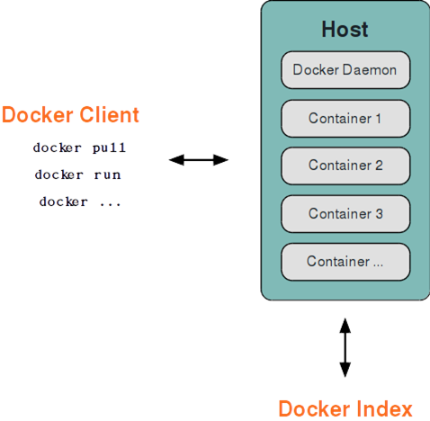
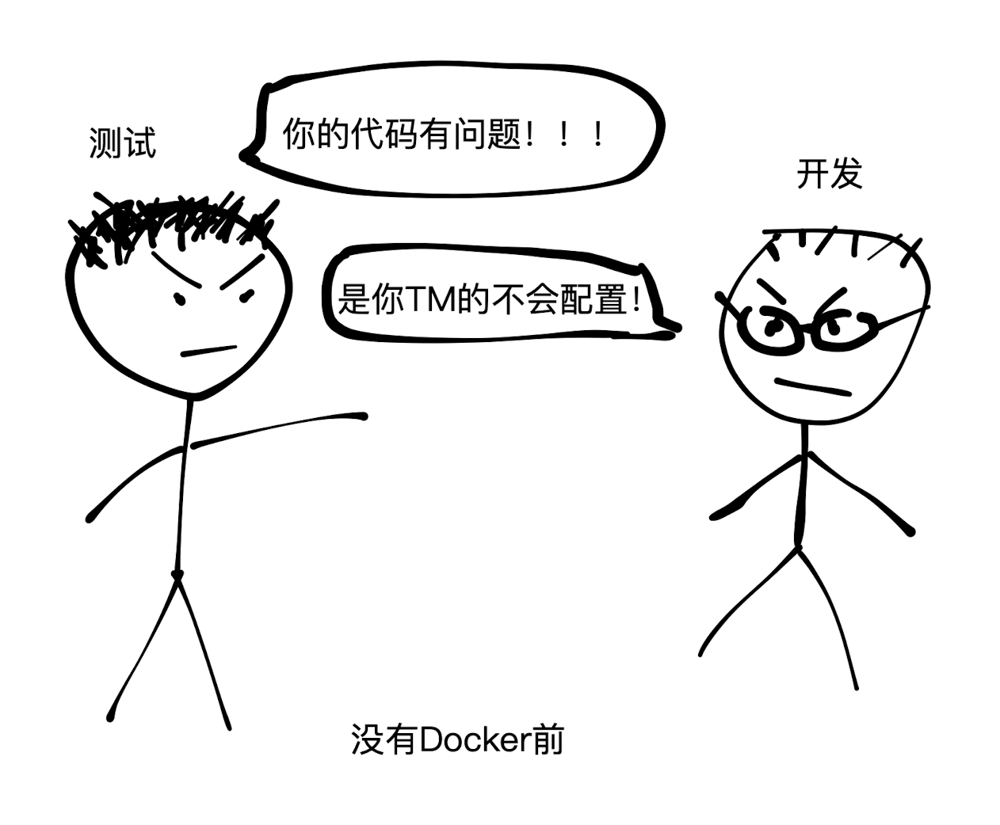

# 第十节课 docker, docker compose

# 概念篇

## 基本架构

以 C/S 为基础的架构



- docker -H tcp://host:port   即可连接远程开放了 tcp 连接的 docker server

## control group

又称 cgroup，linux 实现资源控制的一个组件

通常挂载在 /sys/fs/cgroup 下，受某个 cgroup 控制的进程的 pid 会存放到改 cgroup 的 `cgroup.procs` 文件下，而且 cgroup 还可以控制线程 (更细的粒度控制程序)

cgroup v2 linux kernel document: [https://www.kernel.org/doc/html/v5.10/admin-guide/cgroup-v2.html](https://www.kernel.org/doc/html/v5.10/admin-guide/cgroup-v2.html)

常见的控制：

- cpu 限制
    - cpu.max  限制 cpu 最大使用量，格式：`$MAX $PERIOD`，`$MAX / $PERIOD` 表示最多同时使用 cpu 数
    - cpuset.cpus  限制可以使用的 cpu 编号
        - cpuset.cpus.effective  中的编号表示这层 cgroup 最多允许使用的 cpu
- memory 限制
    - memory.max  限制最大可使用的内存，超出会 OOM
    - memory.high  期望最大可使用的内存，超过内核会尽量会清理内存
    - [memory.swap.xxx](http://memory.swap.xxx)  交换内存相关

## namespace

linux 内核中用于隔离进程的组件

提供两个系统调用用于创建被隔离的进程

- clone：类似 fork，会创建一个新的被隔离的子进程
- unshare：将当前进程从当前 namespace 脱离，加入到创建的 namespace 中

传入 `CLONE_NEW*` 的那几个 flag 即可获得对应类别的隔离

在 docker 里，使用了六种隔离：

- CLONE_NEWNS: 挂载隔离
- CLONE_NEWUSER: 用户系统隔离
- CLONE_NEWPID: 进程 pid 隔离
- CLONE_NEWNET: 网络隔离
- CLONE_NEWIPC: 进程间通讯隔离
- CLONE_NEWUTS: 主机名和域名隔离

此外还有

- CLONE_NEWCGROUP: cgroup 隔离，不设置的话会继承父进程的 cgroup，只有 `privileged` 进程才可以在 clone/unshare 时带上这个 flag

# 实践篇

## 安装 WSL or 租赁服务器

教程链接：[https://www.bilibili.com/read/cv17689315](https://www.bilibili.com/read/cv17689315)

## 也许根本不用去讲？

Docker & Docker compose 入门到实践：

[https://yeasy.gitbook.io/docker_practice/](https://yeasy.gitbook.io/docker_practice/)

[https://vuepress.mirror.docker-practice.com](https://vuepress.mirror.docker-practice.com/)

Docker Docs

https://docs.docker.com/engine/reference/run/

（这不比我在这扯半天要好？

## 为什么要有 Docker?

只为尝试解决程序员届未解难题 —— ”为什么我这好好的，到你那就不行了？“




还有一些需要隔离化运行的领域，如 Online Judge 

## 基础概念


### 镜像

如果将写好的源代码或编译后生成的可执行文件打包，那就可以称之为镜像了，镜像的特点就是可以分发，存储…

docker 的镜像有着自己的储存格式，每个镜像相当于一个 root 的层状文件系统，不仅仅包含了服务程序本身，还包含了程序所有的依赖，例如 python, java 程序需要一个对应的解释器环境

在 dockerhub ([https://hub.docker.com/](https://hub.docker.com/search?q=busybox)) 中储存了很多镜像


### 容器

容器本质上是一个进程及它的子进程等，一个容器基于一个镜像，十分类似面向对象编程中类与对象之间的关系，容器基于镜像产生，当启动一个容器，我们写的服务程序就开始运行了

容器的生命周期是短暂的，它不像镜像从构建并发布后就可以一直存在。当一个容器被删除，它运行时具有的文件系统会被清理，但它基于的镜像的数据卷不会被删除，所以需要有一个动态变化的数据或者持久化容器内程序的运行结果，要将其放到数据卷内挂载到容器内部，否则容器被删除后文件也会被删除

### 仓库

一个镜像属于一个仓库，可以通过 “仓库名称:镜像tag” 来定位一个具体的镜像

### Registry

一个储存大量仓库的地方，最大的公开 Registry 莫过于 docker hub ([https://hub.docker.com/](https://hub.docker.com/search?q=busybox)) 

## 用镜像 —— Docker cli

### 一张图学会用镜像


### 最最常用的命令

- docker images
  - 查看当前所有的镜像

- docker run
    - -v   指定数据卷挂载
    - -it  分配一个可以交互的终端
    - -d  后台运行
    - —rm  容器结束了自动删除
    - —name  分配一个名称
    - -p  端口映射
    - 剩下的查文档咯
- docker exec
    - -it   分配一个可以交互的终端
- docker logs
    - 看日志
- docker stop
    - 关闭容器
- docker start
    - 开启容器
    
- docker rm
    - -f  强制删除
    - 删除容器
- docker rmi
    - 删除镜像
- docker build
    - 打包镜像
- docker pull
    - 拉取镜像
- docker cp
    - 容器内外复制文件
    - 我没怎么用过（
- docker ps
    - 查看当前正在运行的容器
    - -a  包括关闭的容器


### 也许只需要会点点点就行了


### 容器里面的世界和容器外面的

容器本质上是隔离了大部分资源的一个进程及它的子进程，它隔离了 6 种东西

- 挂载信息隔离
    - 容器内的进程无法影响外面的挂载
    - 如果这时切换了进程的根(root)文件系统，那么它连看都看不到外面的挂载
        - 体现在 ps 等需要读取挂载目录的命令无法使用
- 进程间通信隔离
    - 容器里的进程看不到外面操作系统中的进程间通讯对象，如管道，消息队列等
- 用户系统隔离
    - 容器内的用户系统和外面的可以不一样
    - 这时候需要维护一个用户 id 和 用户组 id 到容器内的映射
        - /proc/{pid}/uid_map 和 /proc/{pid}/gid_map 中
    - 可以实现运行容器的是普通用户，容器内是 root 用户
- 主机名和域名隔离
    - 可以隔离主机的名称 (hostname) 和域名，在网络上将会被识别成一个单独的节点，而非一个具体的进程
    - 这样就可以重复开 80，443 这些端口了
    - 可以将容器内部的端口映射到容器外面
- PID 隔离
    - 容器里的 pid 将重新编号，容器内文件系统挂载 proc 可以看到这个容器具体的进程和子进程的信息
- 网络隔离
    - 容器内的进程看不到宿主机的网络配置等信息
    - 当 run 设置 —net=host 将不启动这个隔离，即容器里面的进程的网络与宿主机共享
    - docker 通过创建一个虚拟网卡，一端连接宿主机，一段连容器内部来实现网络配置

## 做镜像 —— Dockerfile

使用 docker build 这个命令，指定一个 Dockerfile 就可以打包出一个镜像

其实 docker build 这个命令也会开启一个容器，在这个容器里面执行 Dockerfile 里面定义的操作，然后将最终的成品的结果打包成镜像

### 最最常用的命令

- FROM
    - 指定基于的镜像
    - 特殊镜像
        - scratch   一个空的镜像
- RUN
    - 在镜像内执行一个命令
    - 如果有多个命令最好用 && 连接起来使用一个 RUN
        - 这样不会增加镜像的体积
- COPY
    - 将构建上下文中的文件复制进构建容器中
    - 使用 —chown=<user>:<group> 参数可以指定里面的文件所属用户和组 (不常用，出现权限问题再考虑)
    - 使用 —from  在多阶段构建时复制之前阶段产生的文件
- ENV
    - 配置容器内的环境变量
- WORKDIR
    - 更改当前的工作目录
    - 请不要写出这样的窒息操作
        - RUN mkdir -p /app && cd /app
        - RUN echo “hi” > hi.txt
        - 每一个命令的工作目录是不共享的！默认是根目录 /
- CMD
    - 指定入口程序
    

### 多阶段构建

每一个 FROM 命令都会另起一个构建的流程，我们可以把：编译代码——发布成品 分开，写进一个 Dockerfile 里

```dockerfile
FROM golang:1.16-alpine AS build

WORKDIR /go/src/github.com/org/repo

COPY . .

RUN go build -o server .

FROM build AS development

RUN apk update \
    && apk add git

CMD ["go", "run", "main.go"]

FROM alpine:3.12

EXPOSE 8000

COPY --from=build /go/src/github.com/org/repo/server /server

CMD ["/server"]
```

### PS

- 确保构建时的镜像基于的环境和部署时基于的环境一致
    - 如部署时使用 alpine，那么构建时也要选择带 alpine tag 的 golang 镜像
    - 防止构建时的动态链接地址到部署时无效
        - 如 alpine 的 libc 是 musl libc 而不是其他系统中常见的 gun libc，它们的动态链接库位置不一样
- 到指定阶段停止
    - docker build —target=xxx  ….
- 在 goland 里面配置使用 docker 来运行

## 同时用很多镜像 —— docker-compose

docker-compose 可以快捷的创建多个容器

不同容器间，可以使用对方的名称来代替使用对方的虚拟网卡 ip 地址来访问

### 一个较全面的例子

```yaml
version: '3'

services:
  traefik:
    container_name: traefik
    image: traefik:v2.8
    ports:
      - "443:443"
      - "80:80"
      - "8080:8080"
    volumes:
      - ./traefik-data/log:/var/log/
      - ./traefik-data/traefik.toml:/etc/traefik/traefik.toml
      - ./traefik-data/letsencrypt:/letsencrypt
      - /var/run/docker.sock:/var/run/docker.sock
    labels:
      - "traefik.enable=true"
      - "traefik.http.services.traefik.loadbalancer.server.port=8080"
      - "traefik.http.routers.traefik.tls=true"
      - "traefik.http.routers.traefik.tls.certresolver=myresolver"
      - "traefik.http.routers.traefik.middlewares=base-auth@docker"

  whoami:
    container_name: whoami
    image: containous/whoami
    labels:
      - "traefik.enable=true"
      - "traefik.http.routers.whoami.tls=true"
      - "traefik.http.routers.whoami.tls.certresolver=myresolver"
      - "traefik.http.middlewares.base-auth.basicauth.users=$ACCOUNTS"
      - "traefik.http.routers.whoami.middlewares=base-auth@docker"

networks:
  default:
    external:
      name: traefik-net
```

## 多台机器上用镜像 —— k8s、docker swarm

讲不完了

## 怎么实践篇没有代码捏？

### 我们来手搓一个 docker！

> 讲之前先看概念篇
> 

### 起个好名字 —— pocker!

```go
package main

import (
	"flag"
	"fmt"
	"io"
	"os"
	"os/user"
	"path/filepath"
	"strconv"
	"syscall"
)

var (
	daemon = flag.Bool("d", false, "run as a daemon")
)

func runContainer(exe string, daemon bool) {
	wd, err := os.Getwd()
	if err != nil {
		panic(err)
	}
	u, err := user.Current()
	if err != nil {
		panic(err)
	}
	uid, err := strconv.ParseUint(u.Uid, 10, 64)
	if err != nil {
		panic(err)
	}
	gid, err := strconv.ParseUint(u.Gid, 10, 64)
	if err != nil {
		panic(err)
	}
	var files []*os.File = nil
	if !daemon {
		files = []*os.File{os.Stdin, os.Stdout, os.Stderr}
	}
	process, err := os.StartProcess("/bin/busybox", []string{"sh", "init", "-c", "/exe/" + exe}, &os.ProcAttr{
		Dir:   "/",
		Env:   []string{"PATH=/bin"},
		Files: files,
		Sys: &syscall.SysProcAttr{
			Chroot:     wd + "/var/linux-minimal",
			Cloneflags: syscall.CLONE_NEWNET | syscall.CLONE_NEWUTS | syscall.CLONE_NEWIPC | syscall.CLONE_NEWNS | syscall.CLONE_NEWPID | syscall.CLONE_NEWUSER,
			UidMappings: []syscall.SysProcIDMap{
				{0, int(uid), 1},
			},
			GidMappings: []syscall.SysProcIDMap{
				{0, int(gid), 1},
			},
		},
	})
	if err != nil {
		panic(err)
	}
	if !daemon {
		if _, err := process.Wait(); err != nil {
			panic(err)
		}
	} else {
		fmt.Println(process.Pid)
	}
}

func main() {
	flag.Parse()
	executable := flag.Arg(0)
	filename := filepath.Base(executable)
	wd, err := os.Getwd()
	if err != nil {
		panic(err)
	}
	src, err := os.Open(executable)
	if err != nil {
		panic(err)
	}
	exe := fmt.Sprintf("%s/var/linux-minimal/exe/%s", wd, filename)
	dst, err := os.OpenFile(exe, os.O_WRONLY|os.O_CREATE, 0777)
	if err != nil {
		panic(err)
	}
	_, err = io.Copy(dst, src)
	if err != nil {
		panic(err)
	}
	src.Close()
	dst.Close()

	runContainer(filename, *daemon)
}
```

 搓完了！

# 作业

- Lv0：敲一边课件中的指令，运行运行课程的代码
- Lv1：将课件代码 `02-web-compose` 构建出来并运行容器
    - 注意修复 Dockerfile 中泡泡偷偷隐藏的问题
    - 需要服务能正常的调用
- Lv2：为 pocker 实现更多内容吧！
    - —cpus 参数设置容器可以调度的 cpu 数量
    - —mem 参数设置容器可以使用的最大内存
- LvX：创造属于你自己的 pocker
    - 网络隔离
    - 镜像文件系统
    - Registry
    - 别卷了别卷了，赶紧去大厂找个班上吧！