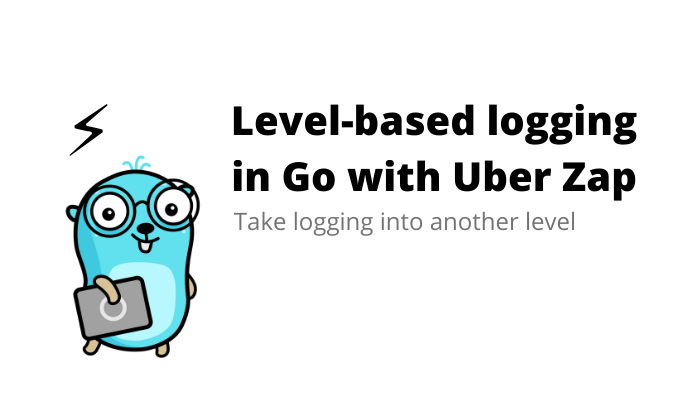

# 第八节课 单体架构项目（理论课+实战课）

## 🎗 前置知识

> 列举一些本节课相比于之前的课需要用到的一些新知识（组件）

**context (上下文)**


> 在web系统中，每次的网络请求都会创建一个协程或者线程去处理请求，在每一个请求中基本上都会另外开多个协程去请求对应的数据资源， 那如何的进行协程间的等停和数据传递呢，这里就用到了 **context** 了，也就是上下文对象，其实在大部分的语言中都没有 **context** 的概念。

[标准库 context 介绍](https://www.kancloud.cn/imdszxs/golang/1509625)

[标准库 context 原理分析](httdps://draveness.me/golang/docs/part3-runtime/ch06-concurrency/golang-context/)

 [Gin 的上下文](https://juejin.cn/post/7034101056439058439)

**viper (配置管理)**


> 通常，在一个或多个项目中我们需要使用定义一些配置（数据库的配置，项目功能的参数配置），从而我们可以在项目的开发或上线过程中可以快速的自定义项目的一些功能，以便满足我们的一些特定需求，那么项目中的配置如何管理呢，在 Go 中我们需要用到叫做 **Viper** 配置管理器。

通常情况下，推荐使用viper库来读取配置文件， **viper 支持以下功能：**

- 支持 `yaml`、`json`、`toml`、`hcl` 等格式的配置文件
- 可以从`文件`、`io.Reader` 、`环境变量`、`cli命令行` 中读取配置
- 支持自动转换的类型解析
- 可以远程从Key/Value中读取配置，需要导入 viper/remote 包
- 监听配置文件。以往我们修改配置文件后需要重启服务生效，而Viper使用watch函数可以让配置自动生效。

[Go语言配置管理神器——Viper中文教程](https://www.liwenzhou.com/posts/Go/viper_tutorial/)

**zap (日志管理)**



> 程序员的日常离不开日志，日志就好比私人秘书，负责运行周期一切 **trace** 工作。优秀的日志实践能极大帮助地程序员快速定位问题，减少在线错误报警。
>
> 在 Go 中我们用到 **zap** 作为日志记录器

[日志实践准则](http://www.yunweipai.com/23766.html)

[在Go语言项目中使用Zap日志库](https://www.liwenzhou.com/posts/Go/zap/)

[Zap 日志库实践](https://juejin.cn/post/7032091256457003044)

**Gorm (ORM库)**


> The fantastic ORM library for Golang aims to be developer friendly.
>
> ####特性
>
> - 全功能 ORM
> - 关联 (Has One，Has Many，Belongs To，Many To Many，多态，单表继承)
> - Create，Save，Update，Delete，Find 中钩子方法
> - 支持 `Preload`、`Joins` 的预加载
> - 事务，嵌套事务，Save Point，Rollback To Saved Point
> - Context、预编译模式、DryRun 模式
> - 批量插入，FindInBatches，Find/Create with Map，使用 SQL 表达式、Context Valuer 进行 CRUD
> - SQL 构建器，Upsert，数据库锁，Optimizer/Index/Comment Hint，命名参数，子查询
> - 复合主键，索引，约束
> - Auto Migration
> - 自定义 Logger
> - 灵活的可扩展插件 API：Database Resolver（多数据库，读写分离）、Prometheus…
> - 每个特性都经过了测试的重重考验
> - 开发者友好

[官网](https://gorm.io/zh_CN/)

[GitHub](https://github.com/go-gorm/gorm)

**go-redis (redis客户端)**


> Redis客户端，支持连接哨兵及集群模式

建议用v8或者v9版本，即使用以下任意一行命令

```
go get -u github.com/go-redis/redis/v8
go get -u github.com/go-redis/redis/v9
```

[官网](https://redis.uptrace.dev/)

[GitHub](https://github.com/go-redis/redis)

[中文教程](https://www.liwenzhou.com/posts/Go/redis/)

[Redis 命令参考](http://redisdoc.com/index.html)

**Gin (Web框架)**


> Gin 是一个用 Go (Golang) 编写的 web 框架。它是一个类似于 martini 但拥有更好性能的 API 框架，由于 httprouter，速度提高了近 40 倍。 如果你是性能和高效的追求者，你会爱上 Gin。

[官网](https://gin-gonic.com/)

[GitHub](https://github.com/gin-gonic/gin)

[中文文档](https://learnku.com/docs/gin-gonic/1.7)

[Gin 框架介绍及使用](https://www.liwenzhou.com/posts/Go/gin/)

**golang-jwt (JWT库)**


> 一个封装好的 JWT 库

[GitHub](https://github.com/golang-jwt/jwt)

[在 gin 框架中使用 JWT](https://www.liwenzhou.com/posts/Go/json-web-token/)

[JWT 测试网站](https://jwt.io/)

## 📄 前言

`Go 语言` 是一门简单、易学的编程语言。

- 对于**有编程经验的工程师**来说，学习并熟练掌握 ` Go 语言` 是手到擒来的事情，但是对于之前有过其他语言经验的开发者来说，写什么语言都像自己学过的语言其实是有问题的。想要真正融入 `Go 语言 `这个生态，并且能够写出优雅的代码就一定要花一些时间和精力**了解 Go 语言背后的设计哲学和最佳实践**。
- 对于**零基础的编程小白**来说，你学习 `Go 语言` 那更好，因为写 `Go 语言`的代码是很容易的，但是想要写出好的代码并不是一件容易的事情，它需要我们不断地对现有的代码进行反思 一件事情 — "**如何改写这段代码才能让它变得更加优雅**"

优雅听起来是一个非常感性、难以量化的结果，然而这却是好的代码能够带来的最直观感受，它可能隐式地包含了以下特性：

- 容易阅读和理解；
- 容易测试、维护和扩展；
- 命名清晰、无歧义、注释完善清楚；
- …

如何写出优雅的代码？

参考 [知乎](https://www.zhihu.com/question/28492982) 及 [编程的智慧](https://www.yinwang.org/blog-cn/2015/11/21/programming-philosophy)

## 🛠 代码规范


**代码规范**其实是一个老生常谈的问题，我们也不能免俗还是要简单介绍一下相关的内容，Go 语言比较常见并且使用广泛的代码规范就是官方提供的 [Go Code Review Comments](https://github.com/golang/go/wiki/CodeReviewComments)，无论你是短期还是长期使用 Go 语言编程，都应该**至少完整地阅读一遍这个官方的代码规范指南**，它既是我们在写代码时应该遵守的规则，也是在代码审查时需要注意的规范。

**学习 Go 语言相关的代码规范是一件非常重要的事情**，也是让我们的项目遵循统一规范的第一步，虽然阅读代码规范相关的文档非常重要，但是实际开发过程中不能保证所有人（包括自己）都能完成的遵循代码规范的，所以需要一个自动化工具来校验/限制不规范的代码。

**[golangci-lint](https://golangci-lint.run/)** 是一个绝大多数 go 开发者都熟悉的一个工具，可以校验任何 go 项目的代码规范，能够指出不规范的部分，并且支持指定开启/关闭部分类型的校验。

下面是一个写得很好的规范指南，一定要看，而且不能只过一遍就完了，要反复阅读，反复品味才行：

- [Go 语言编码规范](https://yusank.space/posts/go-standard/#%E4%BB%8B%E7%BB%8D)

## 📖 项目初识


在正式一个 Web 项目的开发之前，希望大家能够了解一些**软件工程**的知识，关于了解**软件工程的重要性**可以看看这一篇文章：[软件工程的最大难题](https://www.ruanyifeng.com/blog/2021/05/scaling-problem.html)


一个简单的 **Web 系统**需要有**前端**同学负责**界面的开发**，然后有**后端**的同学**处理前端发送来的请求**然后返回数据给前端（本节课讲到的项目不会考虑高并发等复杂的情况）。

我们先从一个 Web 请求出发，看看这个请求经历了哪些东西（主要介绍请求经历后端的处理流程）：


1. 用户在 Web 界面上**点击了一个按钮**，然后前端发起一个请求到后端

2. **请求到达后端**

    

    通常情况下，后端的工作就是**解析前端的数据，处理对应的业务逻辑然后返回操作结果**。

    在这里，离不开三层概念：

    - **API 层**：解析来自前端的数据，转化成 Go 的数据结构
    - **Service 层**：包含业务逻辑，将解析后的请求数据进一步处理
    - **Dao 层**：根据业务逻辑从数据库中存取数据，进行数据持久化

    当然，这三层逻辑并不绝对，会因为项目特点有所调整，但整体的**分层思路**是不会变化的。我认为，如果你能真正地理解web的分层，对项目的框架就能掌握得很棒了。

3. **API 层**

    

    通常来说，**API 层**只做三件事：

    - **根据路由规则，调用具体的处理函数**，常见的 `RESTful API`  就是由 `URL` + `Method` 作为路由规则
    - **解析` 文本` 或 `二进制数据` 到 Go 结构体**，创建的使用 `json` 或 `proto` 反序列化
    - **调用下一层 `Service` 的函数**

    在开发的过程中，我对 API 层的开发会重点关注以下几点：

    - **可读性**：可以快速地根据命名了解功能，如 `RESTful`，`函数命名`
    - **复用性**：引入各种中间件，如 `日志打印`，`recovery 中间件`，`用户认证中间件` 等
    - **简洁性**：不做或少做业务逻辑处理，复杂处理都丢到 `service` 层

    再强调一下API层的重要性：**API层是程序最关键的入口和出口，能很好地追踪到数据的前后变化情况。** 一个优秀的API层实现，不仅能让我们少写很多重复性代码，也能大幅度地降低我们排查问题的效率。

4. **Service 层**

    

    Service 层可以理解为服务层，是整个项目中最复杂、也是代码比重往往是最多的。它是一个项目最核心的业务价值所在。

    Service是最灵活、也是最考验设计能力的，虽说**没有一套固定的模式**，但还是会有一定的**套路**。

    我分享一下个人的三个见解：

    1. 单元测试覆盖率要尽量高，这是一个**高频迭代与重构**的模块，也是最容易出现问题的部分；
    2. 深入实践 **面向[对象](https://zhuanlan.zhihu.com/p/75265007)与[DDD](https://developer.aliyun.com/article/863048)** ，最锻炼工程师抽象、解耦等能力的模块；
    3. 选择合适的 **[设计模式](http://lailin.xyz/post/go-design-pattern.html)** 可大幅度地提升研发效率；

    再提一句，Service层是和业务一起成长的，前期没必要过度设计。我们把重点放在**单元测试的编写**上即可，适当地选用一些库来提高效率，如开源的 `stretchr/testify`，内部的 `reflect` 等。

5. **Dao 层**

    

    **Dao层**常被理解为**数据持久化层**，但我们可以将它进行一定的延伸：**将RPC调用也当做Dao层**（不妨认为将数据持久化到了另一个服务），来适配微服务架构的场景。

    > 严格意义上，RPC调用和普通的Dao差异有不少，但为了收敛话题，我们暂且不细分。

    今天，我们不关注分布式场景下的各种数据问题，也不考虑各种存储中间件的特点，而是聚焦于一个问题：**如何将内存中的对象持久化到数据库中**。在编程领域，这部分的工具被称为**ORM**。

    以Go语言对接MySQL为例，最常见的为 [Gorm](https://github.com/go-gorm/gorm)，它能很便捷地将一个Go语言中的结构体，映射到MySQL数据库某个表中的一行数据。

    > 请自行对比一下，用go官方的 `sql` 库写增删改查，与用 `Gorm` 写增删改查的工作量差异。

    关于Dao层，我认为有部分的实践是比较通用的：

    1. **选用官方或社区高频使用的库**，避免后期出现功能缺失或性能瓶颈的问题；
    2. **灵活性比易用性更重要**，通过一层浅封装，往往能更适配项目，达到更棒的易用性；
    3. **关注数据库的原理、而不是ORM工具的实现方式**，数据库的原理是长期的积累，对技术选型和排查故障很有帮助。


到这里，我们对这三层有了初步的了解，可以总结为**两边薄（API、Dao），中间厚（Service)**。

这里的实践需要大家不断打磨，比如说：

- API 与 Dao 会随着个人编程能力的提升，不断地总结出更好的编程实践；
- 做性能优化时，优先考虑 Dao，其次考虑 API，这两部分的提效是最明显的；
- 排查问题时，先分析 API 的出入口，再分析 Dao 的出入口，实在解决不了再去看 Service（此时已经是严重的业务逻辑问题了）；

到最后，相信大家对这三层认知会进一步提升：

- **API**：服务对外的门面，通过一个接口定义就能了解大致实现原理；
- **Service**：复杂的业务逻辑，非该服务的核心成员无需关注，而核心成员须重点维护；
- **Dao**：无论是调用**ORM**还是**SDK**，都视为一种**工具集**，是一个技术人员沉淀通用能力的重点。

## 🎞 项目开发流程


一个后端软件工程师的基本工作是**完成后端程序的设计与开发**。而后端开发的工作流程往往包括以下几个方面。

**确定需求**：后端的需求从产品经理来，在确定产品需求的过程中，后端工程师必须**确定产品需求是否存在逻辑问题，并有一套实现方案**。当然，一般情况下产品需求是没问题的，只是实现的难易程度不同而已。但不排除产品经理不会提出“app主题颜色跟随手机外壳变化而变化”这种需求。

**开发排期**：在确定需求之后，后端工程师要**对自己即将的开发工作做一个时间计划**，以便跟进计划。产品经理往往最在意你的时间节点。不过，最终的时间节点一般和前端工程师一起定的。

**设计接口**：在开发之前我们后端的同学要**和前端的同学沟通接口的设计**，以此来使前后端的开发工作能够并行，不要等到后端的接口写完了之后前端才开始开发工作

**技术方案选择**：确定项目需求和设计完接口之后以后，我们就需要**确定自己的技术方案**，比如说，选择什么开发框架，选择什么数据库里，运行在什么环境里。在一些复杂和高并发的场景中，不仅要考虑程序的功能，更重要的是健壮性和安全性。实际上，在程序开发中，第一重要是安全，其次是健壮，最后才是功能。整个项目架构需要后端工程师进行合理设计，当然了，除了上面说的这些特性，项目应当还要做到易维护。如果做出来的系统只有你自己能搞定，显然是不行的。

**设计数据库**：在项目开发之前，先**设计好数据库**。一般把需要存储的结构化数据进行表结构的设计。数据库设计时需要注意**语意化**，需要给予备注的添加合理的备注。

**项目开发**：在项目开发前，一定要**把开发的功能点整理出来**，并挨个实现。编码开发是整个项目最核心的部分，也是最花时间的部分。

**项目对接**：在开发过程中，要**编写开发文档，接口文档，与前端工程师一起对接功能**。项目后期，配合测试工程师进行项目质量检测，功能测试。最后，配合运维同事进行项目上线。

实际上，要高效高质量地完成后端开发工作，需要学习和作用很多知识。这些技能包括：Linux操作能力，编码能力，数据库设计能力，文档编写能力，英文阅读能力，组织和设计能力。等等，需要在平时工作和生活中不断学习，不断提高自己。

当然，专业技术能力是需要用心学习和总结，如果说技术很容易地学会，很容易登达顶峰，那就不是技术了！

## ⚙ 项目架构


软件行业和建筑行业比较像，如果说我们的产品是一栋高楼大厦，那么程序代码就是建筑高楼的砖坯（我们每天的工作就像是在不停"搬砖"）。


如果说软件架构是高屋建瓴，那么程序代码是软件架构能够准确落地的关键构成。


程序代码如此重要，那么有一个好的代码架构的重要性不言而喻。一个好的软件架构能够让开发人员快速响应业务变化、提高软件的整体开发和维护效率。

一个好的架构，其终极目标应当是，**用最小的人力成本满足构建和维护该系统的需求**。

也就是说，**好的架构目标应当是降低人力成本**，这里包括的不仅仅是开发成本，还有构建运维成本。而增加软件可变性就是架构达到最终目标的核心途径，即架构主要是通过增加软件的可变性来降低人力成本，毕竟，捏橡皮泥比你在石头上雕刻要轻松得多。

▐  **行为和架构哪个重要？**

一个软件的行为固然是很重要的，因为**一个不能按预定行为工作的软件是不会产生价值的**，所以很多程序员认为能实现软件行为是最重要的，根本不该关心架构，反正坏的架构也不是实现不了行为，出了 bug 修复即可。我认为，他们忽略的是随着软件行为的改动，坏的架构将导致他们自己的工作越来越难以进行，改动的代码越来越大，bug 越来越多，项目最终可能不可维护。

一个软件的架构虽然不直接表现在行为上，但其最大的特点就是良好的**可变性**，即使目前行为不符合预期，也能通过低成本的改动将行为改变到预期。

可运行不可变的软件，最终会因为无法改变而导致行为无法迭代或者迭代慢而变成没有价值。可变不可运行的软件，可通过迭代，变成可运行可变软件，所以**架构比行为更重要**。

▐  **恶魔小时候也可爱**


一个不太好的架构，在项目初期有时难以察觉，因为此时项目模块少，功能少，依赖关系显而易见，一切显得毫无恶意，甚至有点简洁美。但是，恶魔小时候往往也很可爱。随着项目的增长，模块增加了，开发人员变多了，恶魔长大了。架构带来的问题逐渐暴露了出来，混乱的层次关系，毫无章法的依赖关系，模块权责不清等问题接踵而至。

对开发人员而言，项目理解成本不断增加，添加小功能都要先理清好几个模块的调用关系，难以测试导致上线后 bug 防不胜防，组件无法复用。项目逐渐长成大家闻风丧胆，避而不及的“大恶魔”。

虽然我们也反对过度设计，但是识别，或者说猜测项目未来符合逻辑的可能变动，将架构设计考虑进项目早期是十分有必要的，**架构设计和调整应该贯穿项目的整个成长过程。**

▐  **架构的理解成本**

架构是有一定理解成本的，甚至架构设计之初会增加一定的系统理解成本，但是一个好的架构理解成本一定不会很高，因为架构的理解也是人力成本。在理解架构设计的意图之前，因为其增加系统的理解成本而否定它的必要性是不合逻辑的。

好的架构，其关键意义在于降低项目发展过程中整体理解成本。

也就是说，架构良好的项目随着业务复杂度增加，项目理解成本增长也是缓慢的。架构不合理的项目随着业务复杂度的增加，整体理解成本可能是指数增长的。


### 通用应用目录分层

**目录结构基本上就是一个项目的门面**，很多时候我们从目录结构中就能够看出开发者对这门语言是否有足够的经验，所以在这里首先要介绍的最佳实践就是如何在 Go 语言的项目或者服务中组织代码。

官方并没有给出一个推荐的目录划分方式，很多项目对于目录结构的划分也非常随意，这其实也是没有什么问题的，但是社区中还是有一些比较常见的约定，例如：[golang-standards/project-layout](https://github.com/golang-standards/project-layout) 项目中就定义了一个比较标准的目录结构。

```
------------------------- go目录 ----------------------------
/cmd：项目的可执行文件名称相符，通常有一个简短的main函数。从/internal和/pkg目录导入代码。其他没有了
/internal： 私有应用程序和库代码
/pkg：外部应用可以导入的库代码
/vendor：应用程序依赖项
-----------------服务应用程序目录 ---------------
/api：协议文件
/web:  静态web组件
-----------------通用应用目录 ---------------
/configs：项目的默认配置
/init：system init （systemd，upstart，sysv) 配置
/scripts：执行各种构建、安装、分析等操作的脚本
/build：打包和持续集成
/deployments：部署配置
/test：测试
-----------------其他目录 ---------------
/docs：文档
/tools：项目支持的工具
/examples：应用程序和公共库实例
/third_party：外部工具
/githooks: - 
/assets: 图片和其他存储的文件
/website：-
不应该有的目录
/src：请不要将项目级别的src目录和工作空间的src目录混淆。
```

#### Go 目录

**▐  cmd**

当前项目的**可执行文件**。`cmd` 目录下的每一个**子目录名称都应该匹配可执行文件**。比如果我们的项目是一个 `grpc` 服务，在 /cmd/**myapp**/main.go 中就包含了启动服务进程的代码，编译后生成的可执行文件就是 ▐  **myapp**。

不要在 `/cmd` 目录中放置太多的代码，我们应该将**公有代码**放置到 `/pkg` 中，将**私有代码**放置到 `/internal` 中并在 `/cmd` 中引入这些包，**保证 main 函数中的代码尽可能简单和少**。

例子：

- [velero](https://github.com/vmware-tanzu/velero/tree/main/cmd)
- [moby](https://github.com/moby/moby/tree/master/cmd)
- [prometheus](https://github.com/prometheus/prometheus/tree/master/cmd)
- [influxdb](https://github.com/influxdata/influxdb/tree/master/cmd)
- [kubernetes](https://github.com/kubernetes/kubernetes/tree/master/cmd)
- [dapr](https://github.com/dapr/dapr/tree/master/cmd)
- [ethereum](https://github.com/ethereum/go-ethereum/tree/master/cmd)

> 注：`cmd` 目录存在有一个前提，那就是项目有**多个可执行文件**，如果你的项目是**微服务**，那么通常是**只有一个可执行文件**的。这时，建议大家直接将 `main.go` 放在项目根目录下，而取消 `cmd` 目录。

▐  **internal**

**私有的**应用程序代码库。这些是不希望被其他人导入的代码。请注意：这种模式是 Go **编译器强制执行**的。有关更多细节，请参阅 Go 1.4 的 [release notes](https://golang.org/doc/go1.4#internalpackages)。并且，在项目的目录树中的**任意位置都可以有 internal 目录**，而不仅仅是在顶级目录中。

私有代码推荐放到 `/internal` 目录中，真正的项目代码应该写在 `/internal/app` 里，同时这些内部应用依赖的代码库应该在 `/internal/pkg` 子目录和 `/pkg` 中，下图展示了一个使用 `/internal` 目录的项目结构：


当我们在其他项目引入包含 `internal` 的依赖时，Go 语言会在编译时报错：

```text
An import of a path containing the element “internal” is disallowed
if the importing code is outside the tree rooted at the parent of the 
"internal" directory.
```

这种错误只有在被引入的 `internal` 包不存在于当前项目树中才会发生，如果在同一个项目中引入该项目的 `internal` 包并不会出现这种错误。

▐  **pkg**

**外部应用程**序可以使用的库代码（如，`/pkg/mypubliclib`）。其他项目将会导入这些库来保证项目可以正常运行，所以在将代码放在这里前，一定要三四而行。请注意，`internal` 目录是一个更好的选择来确保项目私有代码不会被其他人导入，因为这是 Go 强制执行的。使用 `/pkg` 目录来明确表示代码可以被其他人安全的导入仍然是一个好方式。Travis Jeffery 撰写的关于 [I’ll take pkg over internal](https://travisjeffery.com/b/2019/11/i-ll-take-pkg-over-internal/) 文章很好地概述了 `pkg` 和 `inernal` 目录以及何时使用它们。

`/pkg` 在许多开源项目中都使用了，但**未被普遍接受，并且 Go 社区中的某些人不推荐这样做**。

如果**项目确实很小**并且嵌套的层次并不会带来多少价值（除非你就是想用它），那么就不要使用它。**但当项目变得很大，并且根目录中包含的内容相当繁杂**（尤其是有很多非 Go 的组件）时，可以考虑使用 `/pkg`。

例子：

- [prometheus](https://github.com/prometheus/prometheus) 上报和存储指标的时序数据库
- [istio](https://github.com/istio/istio) 服务网格 2.0
- [kubernetes](https://github.com/kubernetes/kubernetes) 容器调度管理系统
- [grafana](https://github.com/grafana/grafana) 展示监控和指标的仪表盘

> 注：
>
> - 对于 `pkg` 目录，如果是在**微服务下，更我建议尽量不使用它**。因为微服务，每个服务都会相对简单，也就是**项目都比较小** pkg 不会带来多大价值。
> - 如果有**公用的代码**，这里更建议大家将这类代码做成**私有库（go module）**，供其他项目复用，**做了物理隔离，更有利于代码的抽象**。
> - 但是，有一种情况，可以考虑使用 `pkg`，那就是有一类**公用的代码只在有限几个项目中可公用**。比如：在**权限服务**中需要使用到**用户服务**的 `User` 结构体，那这种公用的代码，可以考虑放在用户服务的 `pkg` 中，供权限服务引用。

> 注：在 Go 语言中组织代码的方式还有一种叫”平铺“的，也就是**在根目录下放项目的代码**。这种方式在很多**框架或者库**中非常常见，如果想要引入一个使用 pkg 目录结构的框架时，我们往往需要使用 `github.com/golang/project/pkg/somepkg`，当代码都平铺在项目的根目录时只需要使用 `github.com/golang/project`，很明显地减少了引用依赖包语句的长度。所以，对于一个 Go 语言的**框架或者库，将代码平铺在根目录下也很正常**，但是在一个 Go 语言的**服务中使用这种代码组织方法可能就没有那么合适了**。

▐  **vendor**

应用程序的依赖关系（通过手动或者使用喜欢的依赖管理工具，如新增的内置 Go Modules 特性）。执行 `go mod vendor` 命令将会在项目中创建 `/vendor` 目录，注意，如果使用的不是 Go 1.14 版本，在执行 `go build` 进行编译时，需要添加 `-mod=vendor` 命令行选项，因为它不是默认选项。

构建库文件时，不要提交应用程序依赖项。

请注意，从 1.13 开始，Go 也启动了模块代理特性（使用 [https://proxy.golang.org](https://proxy.golang.org/) 作为默认的模块代理服务器）。点击[这里](https://blog.golang.org/module-mirror-launch)阅读有关它的更多信息，来了解它是否符合所需要求和约束。如果 Go Module 满足需要，那么就不需要 vendor 目录。

国内模块代理功能默认是被墙的，七牛云有维护专门的的[模块代理](https://github.com/goproxy/goproxy.cn/blob/master/README.zh-CN.md)。

> 注：从我的实践来看，**Go Module 已经满足需要，不需要 vendor 目录**。

#### 服务端应用程序目录

▐  **api**

`/api` 目录中存放的就是当前项目对外提供的各种不同类型的 API 接口定义文件了，其中可能包含类似 `/api/protobuf-spec`、`/api/thrift-spec` 或者 `/api/http-spec` 的目录，这些目录中包含了当前项目对外提供的和依赖的所有 API 文件：

```bash
$ tree ./api
api
└── user
└── auth
└── comment
```

二级目录的主要作用就是在一个项目同时提供了多种不同的访问方式时，用这种办法避免可能存在的潜在冲突问题，也可以让项目结构的组织更加清晰。

#### Web 应用程序目录

▐  **web**

Web 应用程序特定的组件：静态 Web 资源，服务器端模板和单页应用（Single-Page App，SPA）

> 注：如果项目是个**前后端**的，并且是**一个团队开发**的，那么可以将前端项目放在 `web` 目录下，方便**项目管理**、**构建**、**部署**等，如：[gin-vue-admin](https://github.com/flipped-aurora/gin-vue-admin/tree/main/web)

#### 通用应用程序目录

▐  **build**

**打包和持续集成**所需的文件。

- build/ci：存放持续集成的配置和脚本，如果持续集成平台(例如 Travis CI)对配置文件有路径要求，则可将其 link 到指定位置。
- build/package：存放 AMI、Docker、系统包（deb、rpm、pkg）的配置和脚本等。

例子：

- [cockroach](https://github.com/cockroachdb/cockroach/tree/master/build)

> 注：笔者觉得将对配置文件有路径要求的 link 到指定位置，太过**为了什么而做什么了**，有点**本末倒置**，这样不但没有太大的价值，而且会**给熟悉配置文件的人感觉疑惑，得不偿失**。

▐  **configs**

**配置文件**模板或**默认配置**。

▐  **deployments / deploy**

IaaS，PaaS，系统和容器编排部署配置和模板（docker-compose，kubernetes/helm，mesos，terraform，bosh）。请注意，在某些存储库中（尤其是使用 kubernetes 部署的应用程序），该目录的名字是 **/deploy**。

> 注：如果是用 kubernetes 部署，建议改成 `deploy`，因为在 kubernetes 领域内更让人熟悉。

▐  **init**

系统初始化（`systemd`、`upstart`、`sysv`）和进程管理（`runit`、`supervisord`）配置。

▐  **scripts**

用于执行各种**构建，安装，分析**等操作的脚本。

这些脚本**使根级别的 Makefile 变得更小更简单**。

例子：

- [helm](https://github.com/kubernetes/helm/tree/master/scripts)
- [cockroach](https://github.com/cockroachdb/cockroach/tree/master/scripts)
- [terraform](https://github.com/hashicorp/terraform/tree/main/scripts)

▐  **test**

**外部测试应用程序和测试数据**。随时根据需要构建 `/test` 目录。对于较大的项目，有一个数据子目录更好一些。例如，如果需要 Go 忽略目录中的内容，则可以使用 `/test/data` 或 `/test/testdata` 这样的目录名字。请注意，Go 还将忽略以“.”或“_”开头的目录或文件，因此可以更具灵活性的来命名测试数据目录。

例子：

- [origin](https://github.com/openshift/origin/tree/master/test) (测试数据在 `/testdata` 子目录)

#### 其他目录

▐  **assets**

项目中使用的其他资源（图像、logo 等）。

▐  **docs**

**设计和用户文档**（除了 godoc 生成的文档）。

例子：

- [hugo](https://github.com/gohugoio/hugo/tree/master/docs)
- [gin-vue-admin](https://github.com/flipped-aurora/gin-vue-admin/tree/main/docs)
- [origin](https://github.com/openshift/origin/tree/master/docs)
- [dapr](https://github.com/dapr/dapr/tree/master/docs)

▐  **examples**

应用程序或公共库的示例程序。

例子：

- [nats.go](https://github.com/nats-io/nats.go/tree/master/examples)
- [docker-slim](https://github.com/docker-slim/docker-slim/tree/master/examples)
- [hugo](https://github.com/gohugoio/hugo/tree/master/examples)
- [packer](https://github.com/hashicorp/packer/tree/master/examples)

▐  **githooks**

Git 钩子。

▐  **third_party**

外部辅助工具，**fork 的代码**和其他第三方工具（例如：Swagger UI）。

▐  **tools / utils**

此项目的支持工具。请注意，这些工具可以从 `/pkg` 和 `/internal` 目录导入代码。

例子：

- [istio](https://github.com/istio/istio/tree/master/tools)
- [origin](https://github.com/openshift/origin/tree/master/tools)
- [dapr](https://github.com/dapr/dapr/tree/master/tools)

▐  **website**

如果不使用 Github pages，则在这里放置项目的网站数据。

例子：

- [vault](https://github.com/hashicorp/vault/tree/master/website)
- [perkeep](https://github.com/perkeep/perkeep/tree/master/website)

#### 不应该出现的目录

▐  **src**

有一些 Go 项目确实包含 `src` 文件夹，但通常只有在开发者是从 Java（这是 Java 中一个通用的模式）转过来的情况下才会有。如果可以的话请不要使用这种 Java 模式。你肯定不希望你的 Go 代码和项目看起来向 Java。

不要将项目级别的 `/src` 目录与 Go 用于其工作空间的 `/src` 目录混淆，就像 [How to Write Go Code](https://golang.org/doc/code.html)中描述的那样。`$GOPATH`环境变量指向当前的工作空间（默认情况下指向非 Windows 系统中的$HOME/go）。此工作空间包括顶级 `/pkg`，`/bin` 和 `/src` 目录。实际的项目最终变成 `/src` 下的子目录，因此，如果项目中有 `/src` 目录，则项目路径将会变成：`/some/path/to/workspace/src/your_project/src/your_code.go`。请注意，使用 Go 1.11，可以将项目放在 `GOPATH` 之外，但这并不意味着使用此布局模式是个好主意。

#### 其他文件

▐  **Makefile**

在任何一个项目中都会存在一些需要运行的脚本，

这些脚本文件应该被放到 `/scripts` 目录中并**由 Makefile 触发**。

### Web应用目录

常见的业务项目基本目录结构如下：

<details>
<summary>展开查看</summary>
<pre>
<code>
    ├── app ----------------------------- (项目文件)
        ├── api ------------------------- (对外接口)
		├── global ---------------------- (全局组件对象)
		├── internal -------------------- (内部逻辑)
			├── middleware -------------- (中间件)
			├── model ------------------- (模型层)
			├── service ----------------- (服务层)
		├── router ---------------------- (路由层)
    ├── manifest ------------------------ (交付清单)
       ├── deploy ----------------------- (部署配置文件)
          ├── docker -------------------- (docker配置文件)
          ├── kustomize ----------------- (k8s配置文件)
       ├── sql -------------------------- (mysql初始化配置文件)
    ├── utils/tools --------------------------- (工具包) 
    ├── build.sh ------------------------ (应用运行脚本)
    ├── docker-compolse.yml ------------- (容器构建配置)
    ├── go.mod -------------------------- (go依赖)
    ├── main.go ------------------------- (项目运行入口)
    ├── README.md ----------------------- (项目说明文档)
</code>
</pre>
</details>
#### 对外接口 (api)

服务接口的职责类似于三层架构设计中的`UI`表示层，负责接收并响应客户端的输入与输出，包括对输入参数的过滤、转换、校验，对输出数据结构的维护，并调用 `service` 实现业务逻辑处理。

#### 业务实现 (service)

业务实现的职责类似于三层架构设计中的`BLL`业务逻辑层，负责具体业务逻辑的实现以及封装。

一是用于解耦业务模块之间的调用。

二是负责具体业务逻辑的实现以及封装。

#### 结构模型 (model)

`model`包的职责类似于三层架构中的`Model`模型定义层。模型定义代码层中仅包含全局公开的数据结构定义，往往不包含方法定义。

这里需要注意的是，这里的`model`不仅负责维护数据实体对象（`entity`）结构定义，也包括所有的输入/输出数据结构定义，被`service`共同引用。这样做的好处除了可以统一管理公开的数据结构定义，也可以充分对同一业务领域的数据结构进行复用，减少代码冗余。

▐  数据模型 - `entity`

与数据集合绑定的程序数据结构定义，通常和数据表一一对应。

▐  业务模型 - `model`

与业务相关的通用数据结构定义，其中包含大部分的方法输入输出定义。

▐  数据访问 - `dao`

`dao`的职责类似于三层架构中的`DAL`数据访问层，数据访问层负责所有的数据访问收口。

#### 请求分层流转


▐  **cmd**

`cmd`层负责**引导程序启动**，显著的工作是初始化逻辑、注册路由对象、启动`server`监听、阻塞运行程序直至`server`退出。

▐  **api**

上层`server`服务**接收客户端请求**，转换为`api`中定义的`Req`接收对象、执行请求参数到`Req`对象属性的类型转换、执行`Req`对象中绑定的基础校验并转交`Req`请求对象给`controller`层。

▐  **controller**

`controller`层负责接收`Req`请求对象后**做一些业务逻辑校验**，随后调用一个或多个`service`实现业务逻辑，将执行结构封装为约定的`Res`数据结构对象返回。

▐  **model**

`model`层中**管理所有的业务模型**，`service`资源的`Input/Output`输入输出数据结构都由`model`层来维护。

▐  **service**

`service`是接口层，用于**解耦业务模块**，`service`没有具体的业务逻辑实现，具体的业务实现是依靠`logic`层注入的。

▐  **logic**

`logic`层的**业务逻辑需要通过调用`dao`来实现数据的操作**，调用`dao`时需要传递`do`数据结构对象，用于传递查询条件、输入数据。`dao`执行完毕后通过`Entity`数据模型将数据结果返回给`service`层。

▐  **dao**

`dao`层通过框架的`ORM`抽象层组件与底层真实的数据库交互

**如何清晰界定和管理`service`和`controller`的分层职责**

`controller`层处理`Req/Res`外部接口请求。负责接收、校验请求参数，并调用**一个或多个** `service`来实现业务逻辑处理，根据返回数据结构组装数据再返回。`service`层处理`Input/Output`内部方法调用。负责内部**可复用**的业务逻辑封装，封装的方法粒度往往比较细。

在真实项目实践中，存在从`controller`层直接透传`Req`对象给`service`，同时`service`直接返回`Res`数据结构对象的情况。但当使用`service`方法处理特定的`Req`对象时，该方法也就与对于的外部接口耦合，仅为外部接口服务，难以复用。这样做会有一定的技术债务成本，具体成本需要自行具体衡量把握尺度。

**如何清晰界定和管理`service`和`dao`的分层职责**

这是一个很经典的问题。

**痛点：**

常见的，开发者把数据相关的业务逻辑实现封装到了`dao`代码层中，而`service`代码层只是简单的`dao`调用，这么做的话会使得原本负责维护数据的`dao`层代码越来越繁重，反而业务逻辑`service`层代码显得比较轻。开发者存在困惑，我写的业务逻辑代码到底应该放到`dao`还是`service`中？

业务逻辑其实绝大部分时候都是对数据的`CURD`处理，这样做会使得几乎所有的业务逻辑会逐步沉淀在`dao`层中，业务逻辑的改变其实会频繁对`dao`层的代码产生修改。例如：数据查询在初期的时候可能只是简单的逻辑，目前代码放到`dao`好像也没问题，但是查询需求增加或变化变得复杂之后，那么必定会继续维护修改原有的`dao`代码，同时`service`代码也可能同时做更新。原本仅限于`service`层的业务逻辑代码职责与`dao`层代码职责模糊不清、耦合较重，原本只需要修改`service`代码的需求变成了同时修改`service`+`dao`，使得项目中后期的开发维护成本大大增加。

**建议：**

我们的建议。`dao`层的代码应该尽量保证通用性，并且大部分场景下不需要增加额外方法，只需要使用一些通用的链式操作方法拼凑即可满足。业务逻辑、包括看似只是简单的数据操作的逻辑都应当封装到`service`中，`service`中包含多个业务模块，每个模块独自管理自己的`dao`对象，`service`与`service`之间通过相互调用方法来实现数据通信而不是随意去调用其他`service`模块的`dao`对象。

**为什么要使用`internal`目录包含业务代码**

`internal`目录是`Golang`语言专有的特性，**防止同级目录外的其他目录引用其下面的内容**。业务项目中存在该目录的目的，是避免若项目中存在多个子项目（特别是大仓管理模式时），多个项目之间无限制随意访问，造成难以避免的多项目不同包之间耦合。

### 小结

每个公司、组织内部都有自己的组织方式，但每个项目都应该有一定的规范。虽然这种规范的约定没有那么强制，但是只要达成了一致之后，对于团队中组员快速理解和入门项目都是很有帮助的。有时候**一些规范，就是团队的共同语言，定好了规范，减少了不必要的重复沟通，有利于提高整体的效率**。

项目目录也一样，本篇文章讲的是参考 [golang-standards](https://github.com/golang-standards/project-layout) 提供的规范。但是，**最重要的还是要与自己的团队商量，讨论并整理出适合自己的一套项目目录规范**。

**一致的项目目录规范，有助于组员快速理解其他人的代码，不容易造成团队的”单点故障“；团队团结一致，共同维护和升级项目目录结构，可不断沉淀，不断提高效率，减少犯错**。

## 🔧 实操


## 📒 后记

[如何写出优雅的 Go 语言代码](https://draveness.me/golang-101/)

[go-gin-example](https://github.com/EDDYCJY/go-gin-example/blob/master/README_ZH.md)：一些 Gin 的实践例子

[RESTful API 设计](https://blog.stellaris.wang/p/interview/restful-api/)

[简洁架构](https://blog.cleancoder.com/uncle-bob/2012/08/13/the-clean-architecture.html)

### 一些好的 Web 项目

[gin-vue-admin](https://github.com/flipped-aurora/gin-vue-admin)

[alist](https://github.com/alist-org/alist)

[awesome-gf](https://github.com/gogf/awesome-gf)

## 📝 作业

**Lv.0**

反复阅读本次课件，对项目知识有个大概印象


